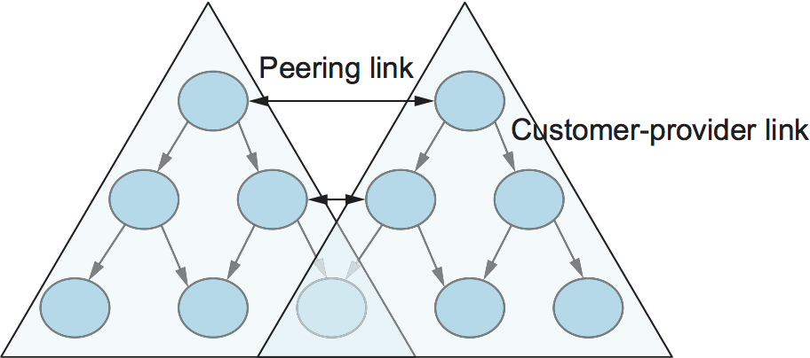
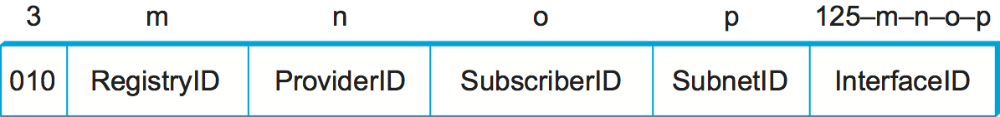

# {{Paj.Toe}}

此时,我们已经看到了如何连接异构的网络集合以创建互联网,以及如何使用IP地址的简单层次结构使互联网中的路由具有一定的可伸缩性. 我们之所以说"有些"可伸缩是因为,即使每个路由器不需要知道连接到因特网的所有主机,但它确实需要知道连接到因特网的所有网络. 今天的互联网有成千上万的网络连接到它 (或更多,取决于你如何计数) . 路由协议,如我们刚才讨论的,并没有扩展到那些类型的数字. 本节介绍各种技术,这些技术极大地提高了可伸缩性,并使得Internet能够尽可能地发展. 

<figure class="line">
	<a id="inet-tree"></a>
	
	<figcaption>The tree structure of the Internet in 1990.</figcaption>
</figure>

在了解这些技术之前,我们需要对全球互联网的面貌有一个大致的了解. 它不仅仅是以太网的随机互连,而是呈现出反映许多不同组织互连的事实的形状. [图1](#inet-tree)在1990给出了一个简单的描述互联网的状态. 从那时起,互联网的拓扑结构已经变得比这个数字所显示的要复杂得多ℴℴ我们在后面的部分给出了当前互联网的稍微更精确的图片ℴℴ但是这张图片目前可以. 

这种拓扑结构的一个显著特征是,它由连接到服务提供商网络 (例如,BARRNET是服务于旧金山湾区的站点的提供商网络) 的最终用户站点 (例如,斯坦福大学) 组成. 在1990,许多供应商服务于有限的地理区域,因此被称为*区域网络*. 区域网络又由全国性的骨干网连接起来. 1990,这一骨干由国家科学基金会资助,因此被称为"国家科学基金". *NSFNET主干网*. 虽然图中没有显示细节,但是提供商网络通常由连接到路由器的大量点对点链路 (例如,过去的T1和DS3链路ㄡ今天的OC-48和OC-192SONET链路) 构建;类似地,每个终端用户站点通常不是单个网络bu而是由路由器和桥接器连接的多个物理网络. 

注意,每个提供者和最终用户很可能是一个管理独立的实体. 这对路由有一些重要的影响. 例如,很可能不同的提供商会对于在其网络中使用的最佳路由协议以及如何将度量分配给其网络中的链接有不同的想法. 由于这种独立性,每个提供商的网络通常是单一的. *自治系统* (AS) . 我们将在后面的章节中更精确地定义这个术语,但是现在认为AS是一个独立于其他AS管理的网络就足够了. 

事实上,互联网具有一个可识别的结构,我们可以利用我们的优势,因为我们处理的可扩展性问题. 事实上,我们需要处理两个相关的缩放问题. 首先是路由的可扩展性. 我们需要找到方法来最小化在路由协议中携带并存储在路由器的路由表中的网络号数. 第二个是地址利用,也就是说,确保IP地址空间不会被消耗得太快. 

在这本书中,我们看到层次结构的原则,一次又一次地使用,以提高可扩展性. 在上一章中,我们看到了IP地址的层次结构,特别是无类别域间路由 (CIDR) 和子网提供的灵活性,如何提高路由的可伸缩性. 在接下来的两节中,我们将看到层次结构 (及其合作伙伴聚合) 的进一步使用,以提供更大的可伸缩性,首先在单个域中,然后是在域之间. 我们的最后一小节将研究IP版本6的新标准,该版本的发明主要是出于可伸缩性的考虑. 

## 路由区域

作为使用层次结构来扩展路由系统的第一个示例,我们将研究如何使用链路状态路由协议 (如OSPF和IS-IS) 将路由域划分成名为*地区*.  (术语在协议之间稍有不同,我们在这里使用OSPF术语. ) 通过添加这个额外的层次结构,我们使单个域能够增长得更大,而不会过度负担路由协议或诉诸下面描述的更复杂的域间路由协议. 

一个区域是一组路由器,它们被管理地配置为彼此交换链路状态信息. 主干区有一个特殊的区域,也称为第0区. 将路由域划分为区域的示例显示在[图2](#ospf-area). 路由器R1ㄡR2和R3是骨干区域的成员. 它们也是至少一个非骨干区域的成员;R1实际上是区域1和区域2的成员. 作为骨干区域和非骨干区域的成员的路由器是区域边界路由器 (ABR) . 注意,这些路由器与位于AS边缘的路由器不同,为了清楚起见,这些路由器被称为AS边界路由器. 

<figure class="line">
	<a id="ospf-area"></a>
	
	<figcaption>A domain divided into areas.</figcaption>
</figure>

一个区域内的路由与前面章节中描述的完全一样. 该区域中的所有路由器相互发送链路状态广告,从而开发出完整ㄡ一致的区域映射. 然而,不是区域边界路由器的路由器的链接状态广告不会离开它们起源的区域. 这具有使洪水和路线计算过程更具可扩展性的效果. 例如,区域3中的路由器R4将永远不会看到来自区域1的路由器R8的链路状态广告. 因此,它将不知道除了它自己的区域的详细拓扑. 

那么,在一个区域中的路由器如何确定在另一区域中注定要到达网络的分组的下一跳?如果我们将必须从一个非骨干区域到另一个非骨干区域的分组的路径想象成分成三个部分,那么这个问题的答案就变得清晰了. 首先,它从源网络传输到骨干区域,然后穿过骨干,然后从骨干传输到目的地网络. 为了完成这项工作,区域边界路由器总结他们从一个区域学到的路由信息,并在其广告中提供到其他区域. 例如,R1从区域1中的所有路由器接收链路状态广告,因此可以确定到达区域1中的任何网络的成本. 当R1向区域0发送链路状态广告时,它广告到达区域1中的网络的成本,就像所有这些网络都直接连接到R1一样. 这使得所有区域的0路由器都能学习到在第1区域中的所有网络的成本. 然后,区域边界路由器总结这些信息并将其广告到非骨干区域. 因此,所有路由器学习如何到达域中的所有网络. 

注意,在区域2的情况下,存在两个ABR,因此区域2中的路由器必须选择使用哪个ABR到达主干. 这很容易,因为R1和R2都将是各种网络的广告费用,所以在区域2中的路由器运行它们的最短路径算法时,将清楚哪个是更好的选择. 例如,很明显,在区域1中,R1将是比R2更好的选择. 

当将域划分为区域时,网络管理员在路由的可伸缩性和最优性之间做出权衡. 区域的使用迫使从一个区域到另一个区域的所有分组都通过主干区域,即使可能存在较短的路径. 例如,即使R4和R5直接连接,分组也不会在它们之间流动,因为它们位于不同的非骨干区域. 事实证明,对可伸缩性的需求往往比使用绝对最短路径更重要. 

这说明了网络设计中的一个重要原则. 在某种最优性和可伸缩性之间经常存在权衡. 当引入层次结构时,网络中的一些节点会隐藏信息,从而阻碍它们做出完全最优决策的能力. 然而,信息隐藏对于可伸缩性是必不可少的,因为它节省了所有节点的全局知识. 在大型网络中,可扩展性是一个比完美最优性更为紧迫的设计目标. 

最后,我们注意到有一个技巧,网络管理员可以更灵活地决定哪些路由器在第0区. 这个技巧使用了*虚拟链路*路由器之间. 这种虚拟链路是通过配置不直接连接到区域0的路由器来与路由器交换骨干路由信息而获得的. 例如,可以从R8到R1配置虚拟链路,从而使R8成为骨干的一部分. R8将与其他路由器在区域0中参与链路状态广告泛滥. 从R8到R1的虚拟链路的成本是通过在区域1中发生的路由信息交换来确定的. 该技术有助于提高路由的最优性. 

## 域间路由 (BGP) 

在本章的开始,我们介绍了互联网被组织为自治系统的概念,每个自治系统都受单个管理实体的控制. 一个公司复杂的内部网络可能是单一的,就像一个单一的互联网服务提供商 (ISP) 的网络一样. [图3](#autonomous)显示了一个具有两个自治系统的简单网络. 

<figure class="line">
	<a id="autonomous"></a>
	
	<figcaption>A network with two autonomous systems.</figcaption>
</figure>

自治系统背后的基本思想是提供在大型互联网上分层聚合路由信息的附加方式,从而提高可伸缩性. 现在,我们将路由问题分为两个部分: 单个自治系统内的路由和自治系统之间的路由. 因为因特网中的自治系统的另一个名称是路由. *领域*我们将路由问题的两个部分称为域间路由和帧内路由. 除了提高可伸缩性之外,AS模型还把在一个AS中发生的域内路由与另一个AS中发生的域内路由解耦. 因此,每个AS都可以运行它选择的任何内部路由协议. 它甚至可以使用静态路由或多个协议,如果需要的话. 域间路由问题就是让不同的AS相互共享可达性信息ℴℴ通过给定的AS可以达到的IP地址集合的描述. 

### 域间路由的挑战

也许域间路由的最重要的挑战是每个需要确定自己的路由. *政策*. 在特定AS上实现的简单示例路由策略可能如下所示: "只要可能,我更喜欢通过AS X而不是通过AS Y发送流量,但是如果它是唯一的路径,我将使用AS Y,并且我从不想将流量从AS X传送到AS Y,或者*反之亦然*"当我付钱给AS X和AS Y以便将我的AS连接到互联网的其余部分时,这种策略是典型的,而AS X是我首选的连接提供者,而AS Y是后备选项. 因为我认为AS X和AS Y都是提供者 (大概我付钱让他们扮演这个角色) ,所以我不期望通过跨我的网络在他们之间传输流量来帮助他们 (这叫做*过境*交通) 我所连接的自治系统越多,我可能有越复杂的政策,特别是当你考虑骨干供应商时,它们可能与许多其他供应商和数百个客户互连,并且每个供应商有不同的经济安排 (影响路由政策) . 

域间路由的关键设计目标是,域间路由系统应该支持像上面示例这样的策略以及更复杂的策略. 为了使问题更加困难,我需要能够在没有其他自治系统的任何帮助的情况下实现这样的策略,并且面对其他自治系统可能的错误配置或恶意行为. 此外,人们往往希望保持这些政策. *私有的*因为运行自治系统的实体 (主要是ISP) 经常相互竞争,不希望它们的经济安排公开. 

互联网历史上有两个主要的域间路由协议. 第一个是外部网关协议 (EGP) ,它具有许多限制,其中最严重的限制可能是它相当显著地限制了Internet的拓扑结构. EGP是在Internet具有树状拓扑 (如本文中所示) 时设计的,并且不允许拓扑变得更加通用. 注意,在这个简单的树状结构中,只有一个主干,并且自治系统只作为父母和孩子连接,而不作为对等系统连接. 

EGP的替换是边界网关协议 (BGP) ,它在撰写本文时 (BGP- 4) 为第四版本. BGP通常被认为是互联网中更复杂的部分之一. 我们将在这里讨论一些要点. 

与它的前身EGP不同,BGP实际上没有关于自治系统如何互连的假设ℴℴ它们形成任意的图. 这个模型很明显很通用,可以适应非树形结构的互联网,就像 (正如我们将在下面看到的,互联网仍然有某种结构,但它并不像树那么简单,并且BGP对这种结构不做任何假设. ) 

<figure class="line">
	<a id="inet-1995"></a>
	
	<figcaption>A simple multi-provider Internet.</figcaption>
</figure>

不同于简单的树形结构的互联网[图1](#inet-tree)甚至是相当简单的图片[图4](#inet-1995)当今的互联网由大量相互连接的网络组成,主要由私人公司 (ISP) 而不是政府运营. 许多互联网服务提供商(ISP)的存在主要是为了向"消费者"(即,家中有电脑的个人)提供服务,而其他服务提供商则更像老式的骨干服务,互连其他提供商,有时甚至更大的公司. 通常,许多供应商安排在一个单一的相互连接. *对等点*.

为了更好地理解如何管理自治系统的这种复杂互连之间的路由,我们可以从定义一些术语开始. 我们定义*局部交通*作为在AS内的节点上发起或终止的流量,以及*过境交通*作为通过As的交通. 我们可以将自治系统分为三大类: 

-   存根作为一个只有一个连接到另一个AS;这样的AS将只携带本地交通. 中小企业[图4](#inet-1995)是存根的一个例子. 

-   多宿主AS-一种与多个其他AS相连但拒绝运输过境交通的AS,如顶部的大公司[图4](#inet-1995).

-   .t AS-一个与多个其他AS相连的AS,它被设计成同时承载传输和本地通信,如[图4](#inet-1995).

在前一章中对路由的讨论集中在基于最小化某种链路度量来寻找最优路径,而域间路由的目标则相当复杂. 首先,有必要找到*一些*通向无环路的预定目的地的路径. 第二,路径必须符合路径上各种自治系统的策略,正如我们已经看到的,这些策略可能几乎是任意复杂的. 因此,虽然域内关注于优化路径的标量成本的定义良好的问题,但是域间关注于寻找非循环,*符合策略的*路径是一个更复杂的优化问题. 

还有其他因素使得域间路由困难. 第一个问题只是规模问题. 互联网骨干路由器必须能够转发任何分组在互联网上任何地方. 这意味着有一个路由表,它将提供任何有效IP地址的匹配. 虽然CIDR有助于控制在因特网的骨干路由中携带的不同前缀的数量,但是在编写时不可避免地要传递大约30万个前缀的顺序的许多路由信息. 

域间路由的另一个挑战来自于域的自相关性质. 请注意,每个域可以运行自己的内部路由协议,并使用它选择的任何方案来将度量分配给路径. 这意味着不可能计算跨越多个自治系统的路径的有意义路径代价. 一个供应商的1000的成本可能意味着一个伟大的路径,但它可能意味着一个不可接受的坏的另一个供应商. 因此,域间路由只做广告. *可达性*. 可达性的概念基本上是"您可以通过这个AS到达这个网络"的陈述,这意味着对于域间路由来说,选择一条最佳路径基本上是不可能的. 

域间自治性引发信任问题. 供应商A可能不愿意相信供应商B的某些广告,因为担心供应商B会公布错误的路由信息. 例如,如果供应商B在配置路由器时出错,或者没有足够的容量来承载通信量,那么当供应商B在互联网上广告一条通往任何地方的伟大路线时,信任供应商B可能是一个灾难性的选择. 

信任问题也与上面提到的支持复杂政策的需要有关. 例如,我可能愿意仅当某个特定提供商向某些前缀发布可达性广告时才信任他,因此我有一个策略,该策略说,"如果且仅当AS X向这些前缀发布可达性广告时,使用AS X仅到达前缀$p$和$q$". 

### BGP基础

每个AS都有一个或多个*边界路由器*通过哪些包进入和离开AS. 在我们简单的例子中[图3](#autonomous)路由器R2和R4将是边界路由器.  (多年来,路由器有时也被称为*网关*因此,BGP和EGP协议的名称. 边界路由器只是一个IP路由器,负责在自治系统之间转发数据包的任务. 

参与BGP的每一个都必须至少有一个. *BGP*扬声器,路由器"说"BGP到其他BGP扬声器在其他自治系统. 通常发现边界路由器也是BGP发言者,但事实并非如此. 

BGP不属于路由协议ㄡ距离矢量和链路状态协议的两大类. 不像这些协议,BGP广告*完整路径*作为达到特定网络的自治系统的枚举列表. 它有时被称为*路径向量*因为这个原因的协议. 为了能够根据特定AS的愿望做出上述各种政策决策,必须公布完整的路径. 它还能够容易地检测路由环路. 

<figure class="line">
	<a id="bgpeg"></a>
	
	<figcaption>Example of a network running BGP.</figcaption>
</figure>

要了解这是如何工作的,请考虑非常简单的示例网络[图5](#bgpeg). 假设供应商是转接网络,而客户网络是存根. 提供商A(AS 2)的AS的BGP扬声器将能够为分配给客户P和Q的每个网络号码广告可达性信息. 因此,它实际上会说,"网络128.96ㄡ192.4.153ㄡ192.4.32和192.4.3可以从AS 2直接到达. "在接收到该广告时,网络可以通告"网络128.96ㄡ192.4.153ㄡ192.4.32和192.4.3可以沿着路径(AS 1ㄡAS 2)到达". 类似地,网络192.12.69ㄡ192.4.54和192.4.23可以沿着路径(AS 1ㄡAS 3)到达. 

<figure class="line">
	<a id="aspath"></a>
	
	<figcaption>Example of loop among autonomous systems.</figcaption>
</figure>

BGP的一个重要工作是防止循环路径的建立. 例如,考虑在[图6](#aspath). 它不同于[图5](#bgpeg)只是在AS 2和AS 3之间增加了一个额外的链接,但是现在的效果是自治系统的图在其中具有循环. 假设AS 1知道它可以通过AS 2到达网络128.96,所以它把这个事实通告给AS 3,后者又把它通告回AS 2. 在没有任何环路防止机制的情况下,AS 2现在可以决定AS 3是目的地为128.96的分组的首选路由. 如果AS 2开始向AS 3发送寻址为128.96的分组,AS 3将把它们发送到AS 1;AS 1将把它们发送回AS 2;并且它们将永远循环. 这是通过在路由消息中携带完整AS路径来防止的. 在这种情况下,AS 2从AS 3收到的通路到128.96的广告将包含AS路径(AS 3ㄡAS 1ㄡAS 2ㄡAS 4). 因为2在这个路径中看到了自己,因此得出结论,这不是一个有用的使用路径. 

为了使这种环路防止技术工作,BGP中携带的AS号码显然需要是唯一的. 例如,在上述示例中,如果没有其他AS以相同的方式标识自己,那么AS 2只能在AS路径中识别自己. 直到最近,数字一直是16位数字,并且它们由中央权威机构分配以保证唯一性. 虽然16位只允许大约65000个自治系统,这看起来不是很多,但我们注意到,存根AS不需要唯一的AS编号,这覆盖了绝大多数非提供商网络. 

> 32位AS号码也已定义并于2009年左右开始使用,从而确保AS号码空间不会成为稀缺资源. 

一个给定的广告只会宣传自己认为足够好的路线. 也就是说,如果一个BGP发言者有选择几个不同的路线到一个目的地,它将选择最好的一个根据自己的当地政策,然后这将是它广告的路线. 此外,即使有一个BGP扬声器,也没有义务向目的地宣传任何路线. 这就是AS如何实现不提供过境的策略ℴℴ拒绝向不包含在AS中的前缀通告路线,即使它知道如何到达前缀. 

考虑到链接失败和策略改变,BGP扬声器需要能够取消先前广告的路径. 这是用一种被称为"负面广告"的负面广告来完成的. *退路*. 在BGP更新消息中携带正和负可达性信息,其格式显示在[图7](#bgpup).  (注意,这个图中的字段是16位的倍数,不同于本章中的其他包格式. ) 

<figure class="line">
	<a id="bgpup"></a>
	
	<figcaption>BGP-4 update packet format.</figcaption>
</figure>

与上一章描述的路由协议不同,BGP被定义为运行在TCP之上,TCP是可靠的传输协议. 因为BGP扬声器可以指望TCP是可靠的,这意味着已经从一个扬声器发送到另一个扬声器的任何信息都不需要再次发送. 因此,只要没有什么改变,BGP扬声器就可以简单地发送一个临时的. *保持活力*如果路由器崩溃或变得与它的对等方断开连接,它将停止发送门禁,并且从它那里学习路由的其他路由器将假定那些路由不再有效. 

### 作为关系和政策的共同点

已经说过,政策可能是任意复杂的,但实际上有一些共同的政策,反映了自治系统之间的共同关系. 最常见的关系在[图8](#as-rels). 三个共同的关系以及与之相关的政策如下: 

<figure class="line">
	<a id="as-rels"></a>
	
	<figcaption>Common AS relationships.</figcaption>
</figure>

-   *供应商客户*供应商的业务是将他们的客户连接到互联网的其余部分. 一个客户可能是一个公司,或者它可能是一个较小的ISP (可能有自己的客户) . 因此,共同的政策是向客户宣传我所知道的所有路线,并向每个人宣传我从客户那里学到的路线. 

-   *客户供应商-*在另一个方向上,客户希望自己的提供商向他 (以及他的客户,如果他有的话) 提供流量,并且他希望能够通过自己的提供商将流量发送到互联网的其他部分. 因此,在这种情况下,常见的策略是将从我的客户那里学到的我自己的前缀和路由广告到我的提供商,将从我的提供商那里学到的路由广告到我的客户,但是不要将从一个提供商学到的路由广告到另一个提供商. 最后一部分是要确保客户没有发现自己从事从一个供应商到另一个供应商的运输业务,如果他付钱给供应商为他运输业务,这不符合他的利益. 

-   *同辈*第三个选项是自治系统之间的对称对等. 两个供应商通常认为自己是平等的,因此他们可以访问彼此的客户,而不必支付其他供应商. 这里的典型策略是向客户宣传从客户那里学到的路由,向客户宣传从客户那里学到的路由,但不向任何供应商宣传从客户那里学到的路由,或者*反之亦然*.

这个数字需要注意的一点是它把一些结构带回了显然不结构化的互联网. 在层次结构的底部,我们有一个或多个提供者的客户网络,当我们进入层次结构时,我们看到提供者有其他提供者作为他们的客户. 在顶部,我们有供应商有客户和同行,但不是任何人的客户. 这些提供者被称为*Tier-1*提供者. 

让我们回到真正的问题: 这一切如何帮助我们构建可扩展的网络?首先,参与BGP的节点数量是自治系统数量的次序,远远小于网络数量. 其次,找到一个好的域间路由只是找到一条通往正确边界路由器的路径,其中每个AS只有很少的路径. 因此,我们巧妙地将路由问题细分为可管理的部分,再次使用新的层次结构来增加可伸缩性. 域间路由的复杂性现在取决于自治系统数量的顺序,域内路由的复杂性取决于单个AS中网络数量的顺序. 

### 域间和域内路由集成

虽然前面的讨论说明了BGP说话者如何学习域间路由信息,但是关于域中的所有其他路由器如何获得此信息的问题仍然存在. 有几个方法可以解决这个问题. 

让我们从一个非常简单的情况开始,这也是很常见的. 在存根AS仅在单个点连接到其他自治系统的情况下,边界路由器显然是AS之外的所有路由的唯一选择. 这样的路由器可以注入一个*缺省路由*进入帧内路由协议. 实际上,这是通过边界路由器可以访问域内协议中未明确广告的任何网络的声明. 回想上一章中关于IP转发的讨论,转发表中的默认条目出现在所有更具体的条目之后,并且它匹配任何与特定条目不匹配的条目. 

复杂性的下一步是让边界路由器注入他们从As外部学到的特定路由. 例如,考虑一个提供者的边界路由器,因为它连接到一个客户AS. 该路由器可以了解到网络前缀192.4.54/24通过BGP或者因为信息被配置到边界路由器中而位于客户AS内部. 它可以将该前缀的路径注入到提供程序中运行的路由协议AS中. 这将是这样的广告,"我有一个到成本X的192.4.54/24的链接". 这将导致提供商AS中的其他路由器了解到这个边界路由器是发送目的地为该前缀的分组的地方. 

最终的复杂性级别来自于骨干网络,骨干网络从BGP中学习了太多的路由信息,因此将其注入域内协议变得太昂贵. 例如,如果一个边界路由器想从另一个AS中注入10000个前缀,它必须向那个AS中的其他路由器发送非常大的链路状态分组,并且它们的最短路径计算将变得非常复杂. 由于这个原因,骨干网络中的路由器使用BGP的变体. *内部BGP*(iBGP)有效地将由位于AS边缘的BGP说话者学习的信息重新分配给AS中的所有其他路由器.  (上面讨论的BGP的另一个变体在自治系统之间运行,并且被称为*外部BGP*,或EBGP) . IGBP使AS中的任何路由器能够在向任何地址发送分组时学习最佳的边界路由器. 同时,AS中的每个路由器跟踪如何使用没有注入信息的传统域内协议到达每个边界路由器. 通过组合这两组信息,AS中的每个路由器都能够为所有前缀确定合适的下一跳. 

<figure class="line">
	<a id="ibgp"></a>
	
	<figcaption>Example of interdomain and intradomain routing. All
	routers run iBGP and an intradomain routing protocol. Border
	routers A, D, and E also run eBGP to other autonomous
	systems.</figcaption>
</figure>

要了解这一切是如何工作的,请考虑一个简单的示例网络,表示单个AS[图9](#ibgp). 三个边界路由器AㄡD和E向其他自治系统讲EBGP,并学习如何到达各种前缀. 这三个边界路由器通过在AS中的所有路由器中建立iBGP会话的网格与其他路由器以及内部路由器B和C通信. 现在让我们来关注路由器B如何构建如何将数据包转发到任何前缀的完整视图. 看看左上角[表](#ibgptab)它显示了路由器B从它的IGBP会话中学习的信息. 它知道一些前缀最好通过路由器A,一些通过D,一些通过E. 同时,AS中的所有路由器也运行一些域内路由协议,如路由信息协议 (RIP) 或开放最短路径优先 (OSPF) .  (域内协议的通用术语是内部网关协议或IGP. ) 从这个完全独立的协议中,B学习如何到达其他节点*里面*域,如右上表所示. 例如,为了到达路由器E,B需要向路由器C发送分组. 最后,在底部表中,B将整个画面放在一起,将从iBGP学到的关于外部前缀的信息与从IGP学到的关于到边界路由器的内部路由的信息结合起来. 因此,如果像18.0/16这样的前缀可以通过边界路由器E到达,并且到E的最佳内部路径是通过C,那么应该将目的地为18.0/16的任何分组转发到C. 一些边界路由器的AS. 

<figure class="line">
	<a id="ibgptab"></a>
	
	<figcaption>BGP routing table, IGP routing table, and combined
	table at router B.</figcaption>
</figure>

## IP版本6 (IPv6) 

在很多方面,IP的新版本的动机很简单: 处理IP地址空间的耗尽. CIDR极大地帮助控制了因特网地址空间被消耗的速度,并且还帮助控制因特网路由器中需要的路由表信息的增长. 然而,这些技术将不再合适. 特别地,几乎不可能实现100%的地址利用率,因此在第40亿主机连接到因特网之前地址空间将耗尽. 即使我们能够使用全部40亿个地址,现在IP地址不仅分配给成熟的计算机,而且分配给移动电话ㄡ电视和其他家用电器,也不难想象这个数字会用尽的方式. 所有这些可能性都认为,最终需要比32位提供更大的地址空间. 

### 历史透视

IETF开始研究1991中扩展IP地址空间的问题,并提出了几种替代方案. 由于IP地址被携带在每个IP分组的报头中,所以增大地址的大小指示分组报头的改变. 这意味着互联网协议的新版本,因此,需要为互联网中的每个主机和路由器提供新软件. 这显然不是一件小事,这是一个需要仔细思考的重大变化. 

定义IP的新版本的努力被称为IP下一代,即IPNG. 随着工作的进展,一个正式的IP版本号被分配,因此IPng现在被称为IPv6. 请注意,本章迄今讨论的IP版本是版本4 (IPv4) . 编号中明显的不连续性是几年前版本号5被用于实验协议的结果. 

改变IP的新版本的意义造成了滚雪球效应. 网络设计人员的普遍感觉是,如果您要改变这种大小,那么最好同时在IP中修复尽可能多的其他东西. 因此,IETF向任何想写白皮书的人索取白皮书,要求他们输入新版本IP可能需要的特性. 除了需要适应可伸缩路由和寻址之外,IPNG中的一些其他愿望列表项目包括: 

-   支持实时服务

-   安全保障

-   自动配置 (即主机能够自动配置它们自己的IP地址和域名等信息) 

-   增强的路由功能,包括对移动主机的支持

值得注意的是,虽然在设计IPv6时IPv4没有这些特性中的许多,但是近年来对所有这些特性的支持已经进入了IPv4,经常在两个协议中使用类似的技术. 可以说,自由地将IPv6看作一块干净的石板,有助于设计新的IP能力,然后将其改造成IPv4. 

除了愿望列表之外,IPng的一个绝对无法协商的特征是必须有一个从当前版本的IP (版本4) 到新版本的转换计划. 由于互联网如此庞大,没有集中控制,完全不可能有一个"标志日",在这个日子里,每个人都关闭他们的主机和路由器,并安装一个新版本的IP. 因此,可能有很长的过渡期,其中一些主机和路由器将只运行IPv4,一些将运行IPv4和IPv6,还有一些将只运行IPv6. 

IETF任命了一个名为IPng理事会的委员会来收集关于IPng要求的所有输入,并评估关于成为IPng的协议的提案. 在这个委员会的一生中,有许多建议,其中一些与其他建议合并,并最终被董事会选为IPng的基础. 那个建议被称为*简单互联网协议* (SIPP) . SIPP最初要求将IP地址大小加倍到64位. 当管理局选择SIPP时,他们规定了若干变化,其中之一是将地址再翻一番,达到128位(16字节). 大约在这个时候,版本号6被分配了. 本节的其余部分介绍了IPv6的一些主要特性. 在撰写本文时,IPv6中的大多数关键规范都是IETF中提出或起草的标准. 

### 地址与路由

首先,IPv6提供了一个128位的地址空间,而不是版本4的32位. 因此,虽然版本4在地址分配效率达到100%时可以潜在地寻址40亿个节点,但是IPv6可以寻址$3.4乘以10^{38}$$节点,再次假设100%的效率. 然而,正如我们已经看到的,100%的地址分配效率是不可能的. 对其他寻址方案的一些分析,例如法国和美国电话网络的寻址方案,以及IPv4的寻址方案,已经为地址分配效率提供了一些经验数据. 基于从这项研究中得出的最悲观的效率估计,IPv6地址空间被预测为每平方英尺地球表面提供超过1500个地址,这看起来当然应该很好地为我们服务,即使金星上的烤面包机有IP地址. 

### 地址空间分配

基于IPv4中CIDR的有效性,IPv6地址也是无类别的,但是地址空间仍然基于领先的比特以各种方式细分. 不是指定不同的地址类,而是引导位指定IPv6地址的不同用途. 前缀的当前赋值列出在[表1](#v6tab).

<a id="v6tab"></a>

|       前缀       |   使用   |
| :------------: | :----: |
|  00ⅆ0 (128位)   |  未指定的  |
|  00ⅆ1 (128位)   |   环回   |
|    1111 1111   |  多播地址  |
| 1111 1110 1110 | 连接本地单播 |
|      其他一切      |  全局单播  |

*表1. IPv6的地址前缀分配*

地址空间的分配值得商榷. 首先,IPv4的三个主要地址类 (AㄡB和C) 的整个功能都包含在"其他一切"范围内. 正如我们不久将看到的,全局单播地址非常类似于无类IPv4地址,只有更长的时间. 这些是目前最感兴趣的,其中99%以上的IPv6地址空间可用于这种重要形式的地址.  (在编写时,IPv6单播地址是从开始的块分配的. `001`,剩下的地址空间约为87%,保留以备将来使用. 

多播地址空间 (显然) 用于多播,从而在IPv4中起到与类D地址相同的作用. 请注意,多播地址很容易区分,它们以所有1s的字节开始. 我们将在后面的部分中看到这些地址是如何使用的. 

链接本地使用地址背后的思想是使主机能够构造一个地址,该地址将在它所连接的网络上工作,而不必担心地址的全局唯一性. 这对于自动配置可能是有用的,正如我们将在下面看到的. 类似地,站点-本地使用地址旨在允许在不连接到较大Internet的站点 (例如,私有企业网络) 上构建有效地址;同样,全局唯一性不必成为问题. 

在全局单播地址空间中有一些重要的特殊类型的地址. 节点可以通过将32位IPv4地址扩展到128位来分配IPv4兼容的IPv6地址. 只有能够理解IPv4的节点可以通过在32位IPv4地址前面加上所有1s的2个字节,然后将结果零扩展到128位来分配IPv4映射的IPv6地址. 这两个特殊的地址类型在IPv4到IPv6过渡中使用 (参见本主题的侧边栏) . 

### 地址符号

正如IPv4一样,有一些写IPv6地址的特殊符号. 标准表示是`x:x:x:x:x:x:x:x`,其中每一个`x`是一个16位的地址的十六进制表示. 一个例子就是

```pseudo
47CD:1234:4422:ACO2:0022:1234:A456:0124
```

任何IPv6地址都可以用这个符号来写. 由于IPv6地址有几种特殊类型,所以有一些特殊符号在某些情况下可能有用. 例如,可以通过省略所有0个字段来更紧凑地写入具有大量连续的0的地址. 因此,

```pseudo
47CD:0000:0000:0000:0000:0000:A456:0124
```

可以写

```pseudo
47CD::A456:0124
```

显然,这种形式的速记只能用于地址中的一组相邻的0,以避免歧义. 

包含嵌入式IPv4地址的两种类型的IPv6地址有它们自己的特殊符号,这使得提取IPv4地址更加容易. 例如,IPv4地址为1289633.821的主机的IPv4映射IPv6地址可以写成

```pseudo
::FFFF:128.96.33.81
```

也就是说,最后32位是用IPv4符号写的,而不是用冒号分隔的一对十六进制数. 注意前面的双冒号表示领先的0. 

### 单播地址

到目前为止,IPv6必须提供的最重要的寻址方式是普通的单播寻址. 它必须以这样的方式来支持新的主机添加到因特网上的快速速率,并且允许在因特网中物理网络的数量增长时以可伸缩的方式进行路由. 因此,IPv6的核心是单播地址分配方案,它决定单播地址如何被分配给服务提供商ㄡ自治系统ㄡ网络ㄡ主机和路由器. 

事实上,针对IPv6单播地址提出的地址分配方案与IPv4中使用CIDR部署的地址分配方案非常类似. 为了理解它是如何工作的以及它如何提供可伸缩性,定义一些新的术语是有帮助的. 我们可以认为非过境为 (即存根或多宿主AS) . *用户*我们可以把过境看作是一种*供应商*. 此外,我们可以细分供应商. *直接的*和*间接的*. 前者直接连接到用户. 后者主要连接其他提供商,不直接连接到订户,并且通常被称为*骨干*
*网络*.

有了这组定义,我们可以看到,互联网不仅仅是一个任意互连的自治系统集合,它具有一些内在的层次结构. 困难之处在于使用这个层次结构,而不需要发明在没有严格遵守层次结构时失败的机制,如EGP.例如,当订户连接到主干或者当直接提供商开始连接到许多其他提供商时,直接提供商和间接提供商之间的区别变得模糊. 

与CIDR一样,IPv6地址分配计划的目标是提供路由信息的聚合,以减少域内路由器的负担. 同样,关键思想是使用地址前缀ℴℴ在地址的最重要末端的一组连续位ℴℴ来聚集可达性信息到大量的网络,甚至到大量的自治系统. 实现此目的的主要方法是向直接提供程序分配地址前缀,然后让该直接提供程序向其订户分配以该前缀开始的较长前缀. 因此,提供者可以为其所有订阅者通告单个前缀. 

当然,缺点是如果一个站点决定改变提供者,它需要获得一个新的地址前缀并重新编号站点中的所有节点. 这可能是一个巨大的任务,足以劝阻大多数人从不断变化的供应商. 由于这个原因,正在对其他寻址方案进行研究,例如地理寻址,其中站点的地址是其位置的函数,而不是其所附属的提供者. 然而,目前,基于提供者的寻址是使路由工作有效的必要条件. 

注意,虽然IPv6地址分配基本上等同于自从引入CIDR以来在IPv4中发生的地址分配方式,但是IPv6具有显著的优点,即没有大的已分配地址的安装基数来适应其计划. 

一个问题是层次聚合是否在层次结构中的其他级别上是有意义的. 例如,是否所有提供程序都应该从分配给它们连接的主干的前缀中获得地址前缀?鉴于大多数供应商连接到多个骨干,这可能是没有道理的. 而且,由于提供商的数量远小于站点的数量,因此聚合在这个级别上的好处要少得多. 

聚集可能有意义的地方是国家或大陆层面. 在网络拓扑中,大陆边界形成自然划分. 例如,如果欧洲的所有地址都有一个共同的前缀,那么就可以进行大量的聚合,而其他大陆的大多数路由器只需要一个具有欧洲前缀的所有网络的路由表条目. 欧洲的供应商都会选择他们的前缀,这样他们就可以从欧洲前缀开始. 使用此方案,IPv6地址可能看起来像[图11](#v6addr). 这个`RegistryID`可能是分配给欧洲地址注册表的标识符,不同的ID分配给其他大陆或国家. 请注意,在这种情况下前缀会有不同的长度. 例如,具有少数客户的提供程序可以具有比具有许多客户的提供程序更长的前缀 (因此可用的总地址空间更少) . 

<figure class="line">
	<a id="v6addr"></a>
	
	<figcaption>An IPv6 provider-based unicast address.</figcaption>
</figure>

当用户连接到一个以上的提供商时,可能会发生一个棘手的情况. 用户应该为他或她的站点使用哪一个前缀?这个问题没有完美的解决办法. 例如,假设一个订户连接到两个提供商,X和Y. 如果订户从X获取前缀,那么Y必须发布一个前缀,该前缀与其他订户没有关系,因此不能聚合. 如果订户用X的前缀和Y的前缀编号他的AS的一部分,那么如果与一个供应商的连接中断,他将冒有一半的网站变得无法访问的风险. 如果X和Y有很多共同订户,那么一种相当有效的解决方案是在它们之间具有三个前缀: 一个用于X的订户,一个用于Y的订户,一个用于X和Y的订户. 

### 数据包格式

尽管IPv6以多种方式扩展IPv4,但它的报头格式实际上更简单. 这种简单性是由于协同努力从协议中删除不必要的功能. [图12](#v6header)显示结果. 

与许多头一样,这个头从A开始. `Version`字段,设置为IPv6的6. 这个`Version`相对于IPv4,字段与头的起始位置相同. `Version`字段,以便头处理软件可以立即决定要查找哪个标题格式. 这个`TrafficClass`和`FlowLabel`字段都涉及到服务质量问题. 

这个`PayloadLen`字段给出包的长度,不包括以字节为单位测量的IPv6报头. 这个`NextHeader`字段巧妙地替换了IP选项和`Protocol`IPv4字段. 如果需要选项,则将它们携带在IP标头后面的一个或多个特殊标头中,这由`NextHeader`字段. 如果没有特殊的标题,`NextHeader`字段是标识在IP (例如,TCP或UDP) 上运行的更高层协议的解复用密钥;也就是说,它用于与IPv4相同的目的`Protocol`字段. 此外,分段现在作为可选的报头处理,这意味着IPv4的分段相关字段不包括在IPv6报头中. 这个`HopLimit`字段是简单的`TTL`对IPv4进行重命名以反映实际使用的方式. 

<figure class="line">
	<a id="v6header"></a>
	
	<figcaption>IPv6 packet header.</figcaption>
</figure>

最后,头部的大部分由源地址和目的地地址占据,每个地址有16字节 (128位) 长. 因此,IPv6报头总是40字节长. 考虑到IPv6地址比IPv4的地址长四倍,这与IPv4报头相比相当好,在没有选项的情况下,IPv4报头长20字节. 

IPv6处理选项的方式比IPv4有很大的改进. 在IPv4中,如果存在任何选项,则每个路由器必须解析整个选项字段以查看是否有任何选项是相关的. 这是因为选项都隐藏在IP报头的末尾,作为" (类型ㄡ长度ㄡ值) "元组的无序集合. 相比之下,IPv6将选项视为*扩展标题*如果存在,必须以特定的顺序出现. 这意味着每个路由器可以快速地确定是否有任何选项与它相关;在大多数情况下,它们不会. 通常这可以通过看`NextHeader`字段. 最终的结果是IPv6中的选项处理效率更高,这是路由器性能的一个重要因素. 此外,作为扩展头的选项的新格式化意味着它们可以具有任意长度,而在IPv4中,它们最多被限制为44字节. 我们将看到下面的一些选项是如何使用的. 

<figure class="line">
	<a id="v6ext"></a>
	
	<figcaption>IPv6 fragmentation extension header.</figcaption>
</figure>

每个选项都有自己的扩展头类型. 每个扩展头的类型由`NextHeader`前面的标头中的字段,每个扩展标头包含一个`NextHeader`字段来标识它后面的标题. 最后一个扩展标头后面跟着一个传输层报头 (例如,TCP) ,在这种情况下,`NextHeader`字段的值与`Protocol`字段将位于IPv4报头中. 因此,`NextHeader`字段执行双重任务;它可以标识要遵循的扩展报头的类型,或者在最后一个扩展报头中,它充当demux密钥,以标识在IPv6上运行的更高层协议. 

考虑碎片标头的示例,如[图13](#v6ext). 这个报头提供了与IPv4报头中的分段字段类似的功能,但是只有在需要分段时才会出现它. 假设它是当前唯一的扩展头,那么`NextHeader`IPv6报头字段包含值`44`,这是分配给碎片标头的值. 这个`NextHeader`碎片标头本身的字段包含一个值,该值描述跟随它的标题. 同样,假设没有其他扩展头,则下一个报头可能是TCP报头,这导致`NextHeader`值包含`6`,就像`Protocol`字段将在IPv4中. 如果碎片报头后面是,例如,一个身份验证头,那么碎片头`NextHeader`字段将包含值`51`.

### 自动配置

虽然互联网的发展令人印象深刻,但阻碍更快地接受该技术的一个因素是,连接到互联网通常需要相当数量的系统管理专门知识. 特别地,连接到因特网的每个主机都需要配置有某种最小量的信息,例如有效的IP地址ㄡ它所连接的链接的子网掩码以及名称服务器的地址. 因此,它不可能解开一台新的计算机,并将其连接到互联网上,没有一些预配置. 因此,IPv6的一个目标是为自动配置提供支持,有时称为自动配置. *即插即用*操作. 

正如我们在前一章中所看到的,对于IPv4,自动配置是可能的,但是它取决于是否存在被配置为向动态主机配置协议 (DHCP) 客户端分发地址和其他配置信息的服务器. IPv6中较长的地址格式有助于提供一种有用的ㄡ新的自动配置形式. *无国籍的*自动配置,不需要服务器. 

回想一下,IPv6单播地址是分层的,而最不重要的部分是接口ID. 

1.  获取在主机所连接的链路上唯一的接口ID. 

2.  为该子网获取正确的地址前缀. 

第一部分变得相当容易,因为链接上的每个主机都必须有一个唯一的链接级别地址. 例如,以太网上的所有主机都有唯一的48位以太网地址. 通过添加适当的前缀,可以将其转换为有效的链接本地使用地址. [表](#v6tab) (`1111 1110 10`其次是足够的0,以弥补128位. 对于一些设备ℴℴ例如,不连接到任何其他网络的小型无路由网络上的打印机或主机ℴℴ这个地址可能完全足够. 那些需要全局有效地址的设备依赖于同一链路上的路由器来周期性地为该链路通告适当的前缀. 显然,这要求路由器配置有正确的地址前缀,并且选择该前缀的方式是在末端有足够的空间 (例如,48位) 来附加适当的链路级地址. 

在IPv6地址中嵌入长达48位的链路级地址的能力是选择如此大的地址大小的原因之一. 128位不仅允许嵌入,而且为我们上面讨论的多级寻址层次结构留下了足够的空间. 

### 高级路由能力

IPv6扩展头的另一个是路由报头. 在缺少该报头的情况下,IPv6的路由与CIDR下的IPv4的路由差别不大. 路由头包含IPv6地址的列表,这些地址表示包在到达目的地的路由中应该访问的节点或拓扑区域. 拓扑区域可以是,例如,骨干提供商的网络. 指定数据包必须访问该网络将是一种基于分组的方式实现提供者选择的方式. 因此,主机可以说,它希望一些数据包通过廉价的提供程序,其他数据包通过提供高可靠性的提供程序,还有一些数据包通过主机信任的提供程序来提供安全性. 

为了提供指定拓扑实体而不是单个节点的能力,IPv6定义了*任播*地址. 选播地址被分配给一组接口,发送到该地址的数据包将到达那些接口的"最接近",最近的由路由协议确定. 例如,可以为主干提供程序的所有路由器分配一个单独的选播地址,该地址将在路由头中使用. 

还可以选择选播地址和路由报头来向移动主机提供增强的路由支持. 提供这种支持的详细机制仍在定义中. 

### 其他特征

正如本节开始时所提到的,IPv6开发的主要动机是支持Internet的持续增长. 然而,一旦为了地址而必须更改IP报头,门就会打开,以便进行各种各样的其他更改,我们刚刚描述了其中的两个更改ℴℴ自动配置和源定向路由. IPv6包括几个附加特性,其中大部分在本书的其他部分都有介绍;例如,移动性ㄡ安全性ㄡ服务质量. 值得注意的是,在大多数这些领域中,IPv4和IPv6的能力已经变得几乎无法区分,因此IPv6的主要驱动仍然是需要更大的地址. 
