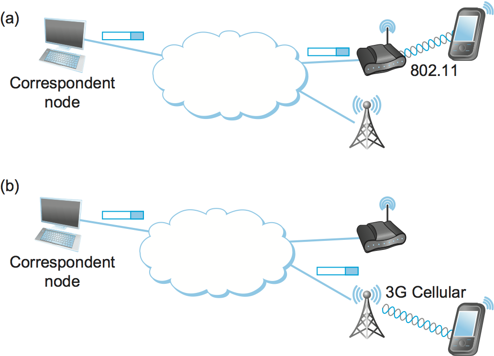

# {{Paj.Toe}}

了解移动设备对Internet体系结构提出了一些挑战,可能不应该是一个很大的惊喜. 互联网是在一个计算机是巨大的ㄡ不移动的设备的时代设计的,虽然互联网的设计者可能有一些想法,移动设备可能在未来出现,但可以公平地假设这不是一个首要任务,以适应它们. 当然,今天,移动计算机无处不在,尤其是以笔记本电脑和具有IP功能的移动电话的形式,并且越来越多地以其他形式,例如传感器. 在本节中,我们将研究移动设备的外观所带来的一些挑战以及当前适应它们的一些方法. 

## 移动网络面临的挑战

这本书的大多数读者可能在某个时候使用过联网的移动设备,对我们许多人来说,移动设备已经成为了规范. 因此,人们可能会合理地认为移动网络是一个解决的问题. 当然,今天很容易出现在无线热点,使用802.11或其他无线网络协议连接到因特网,并且获得相当好的因特网服务. 使热点可行的一个关键使能技术是DHCP. 您可以在咖啡店安顿下来,打开您的笔记本电脑,为您的笔记本电脑获得一个IP地址,并让您的笔记本电脑与默认路由器和域名系统 (DNS) 服务器,以及广泛的应用程序类,您所需要的一切. 

然而,如果我们仔细观察一下,很明显对于一些应用程序场景,每次移动时仅仅获得一个新的IP地址 (这是DHCP为您所做的) 并不总是足够的. 假设您正在使用笔记本电脑或智能手机通过IP电话进行语音通话,并且在通话时,您从一个热点移动到另一个热点,或者甚至从802.11切换到3G无线以便进行互联网连接. 

显然,当您从一个接入网络移动到另一个接入网络时,您需要获得一个新的IP地址ℴℴ与新网络对应的IP地址. 但是,在对话的另一端的计算机或电话不能立即知道您已经移动了哪里或者您的新IP地址是什么. 因此,在没有其他机制的情况下,数据包将继续发送到您所在的地址. *习惯于*是的,而不是你现在所在的地方. 这个问题在[图1](#mobileeg)当移动节点从802.11网络中移动时[图1 (a) ](#mobileeg)在蜂窝网络中[图1 (b) ](#mobileeg)不知何故,来自*通信节点*需要找到他们的方式到新的网络,然后到移动节点. 

<figure class="line">
	
	
	<figcaption>Forwarding packets from a correspondent node to a
	mobile node.</figcaption>
</figure>

有许多不同的方法来解决刚才描述的问题,我们将在下面进行一些研究. 假设有某种方式可以重定向数据包,使它们到达您的新地址而不是您的旧地址,那么下一个显而易见的问题就是安全问题. 例如,如果有一种机制,我可以说,"我的新IP地址是X",那么我如何防止一些攻击者在未经我允许的情况下作出这样的声明,从而使他要么接收我的数据包,要么重定向我的数据包到一些不知情的第三方?因此,我们看到,安全性和流动性是非常密切相关的. 

上面讨论强调的一个问题是IP地址实际上服务于两个任务. 它们被用作一个*标识符*端点的一个端点,它们也用于*定位*端点. 可以将标识符看作端点的长期名称,将定位器看作关于如何将分组路由到端点的一些可能更临时的信息. 只要设备不移动,或不经常移动,使用一个单一的地址,这两个工作似乎相当合理. 但是一旦设备开始移动,您希望有一个标识符,该标识符不会随着移动而改变,这有时称为*端点标识符*或*主机标识符*-还有一个单独的*定位器*. 这种从标识符中分离定位器的想法已经存在很长时间了,并且下面描述的处理移动性的大多数方法以某种形式提供了这种分离. 

IP地址不改变的假设出现在许多不同的地方. 例如,正如我们将在下一章中看到的,传输协议 (如TCP) 在历史上假设IP地址在连接寿命期间保持不变,所以在移动世界中运行的传输协议需要重新评估这个假设. 

虽然我们都熟悉移动端点,但值得注意的是路由器也可以移动. 这当然比端点移动性更不常见,但是在很多环境中,移动路由器可能是有意义的. 一个例子可能是一个紧急响应小组试图部署一个网络后,一些自然灾害已经摧毁了所有的固定基础设施. 当有其他考虑时*全部的*网络中的节点,而不仅仅是端点,是移动的,我们将在本节后面讨论的主题. 

与许多技术一样,对移动性的支持也带来了增量部署的问题. 鉴于此,在互联网的前二十年中,它完全由没有移动的节点组成,可以公平地假定,在可预见的将来会有许多路由器和主机围绕着这个假设运行. 因此,移动性解决方案需要处理增量部署. 相反,IP版本6从一开始就具有将移动性作为其设计的一部分的能力,这使它具有一些优点. 

在我们开始研究支持移动设备的一些方法之前,需要澄清两点. 人们常常发现,人们把无线网络与移动性混淆了. 毕竟,由于显而易见的原因,经常会发现移动和无线连接在一起. 但是,无线通信实际上是在没有线路的情况下从A到B获取数据,而移动性则是在节点通信时处理周围移动时发生的情况. 当然,许多使用无线通信信道的节点不是移动的,并且有时移动节点将使用有线通信 (尽管这不太常见) . 

最后,在本章中,我们最感兴趣的是我们所说的. *网络层移动性*. 也就是说,我们感兴趣的是如何处理从一个网络移动到另一个网络的节点. 在同一802.11网络中从一个接入点移动到另一个接入点可以由802.11特有的机制来处理,蜂窝电话网络当然也有处理移动性的方法,但是在像因特网这样的大型异构系统中,我们需要更广泛地支持跨网络的移动性. 奥克斯. 

## 移动主机路由 (移动IP) 

移动IP是当今互联网体系结构的主要机制,以解决将分组路由到移动主机的问题. 它引入了一些新功能,但不需要对非移动主机或大多数路由器进行任何更改,因此解决了上面提出的增量部署问题. 

假定移动主机具有永久IP地址,称为*家庭住址*,它的网络前缀等于它的*家庭网络*. 这是其他主机在最初向移动主机发送数据包时将使用的地址;因为它不会改变,所以长寿的应用程序可以在主机漫游时使用它. 我们可以认为这是宿主长期存在的标识符. 

当主机从其归属网络移动到新的外部网络时,它通常使用诸如DHCP之类的手段在该网络上获取新地址. 每当主机漫游到一个新的网络时,这个地址就会改变,所以我们可以认为这更像是主机的定位器,但是重要的是要注意,当主机在外部网络上获得一个新的地址时,它不会丢失其永久的归属地址. 这个家庭地址是至关重要的,它的能力,以维持通信,因为它的移动,我们将在下面看到. 

> 由于DHCP是和移动IP同时开发的,所以最初的移动IP标准不需要DHCP,但是DHCP在当今是普遍存在的. 

虽然大多数路由器保持不变,但移动性支持确实需要在至少一个路由器中使用一些新功能,称为*归属代理*移动节点的. 该路由器位于移动主机的家庭网络上. 在某些情况下,具有增强功能的第二路由器,*国外代理,*也是需要的. 该路由器位于一个网络上,当移动节点远离其家庭网络时,该网络附着到该网络上. 我们将首先考虑移动IP在使用外部代理时的操作. 一个具有国内和国外代理的示例网络显示在[图2](#mobile).

<figure class="line">
	
	
	<figcaption>Mobile host and mobility agents.</figcaption>
</figure>

国内外代理商都定期使用代理商广告消息在所连接的网络上宣布他们的存在. 移动主机也可以在连接到新网络时请求广告. 归属代理的广告使移动主机能够在离开其归属网络之前了解其归属代理的地址. 当移动主机连接到外部网络时,它听到来自外部代理的广告,并向代理注册,提供其归属代理的地址. 然后,外部代理与本地代理联系,提供一个代理. *转交地址*. 这通常是外部代理的IP地址. 

此时,我们可以看到,任何试图向移动主机发送分组的主机都将使用与该节点的归属地址相等的目的地址发送它. 正常的IP转发将导致该分组到达归属代理所在的移动节点的家庭网络上. 因此,我们可以将分组传递到移动节点的问题分为三个部分: 

1.  归属代理如何截获注定要为移动节点的数据包?

2.  本地代理如何将包传递给外部代理?

3.  外部代理如何将数据包传送到移动节点?

如果你只看一看,第一个问题可能很简单. [图2](#mobile)其中,归属代理显然是发送主机和归属网络之间的唯一路径,因此必须接收目的地为移动节点的分组. 但是,如果发送(通信)节点位于网络18上,或者如果连接到网络18的另一路由器试图在不通过归属代理的情况下传送分组,该怎么办?为了解决这个问题,归属代理实际上使用一种称为移动节点的技术来模拟移动节点. *代理ARP. *除了归属代理在ARP消息中插入移动节点的IP地址 (而不是自己的IP地址) 之外,这与地址解析协议 (ARP) 一样工作. 它使用自己的硬件地址,以便同一网络上的所有节点学习将归属代理的硬件地址与移动节点的IP地址相关联. 这个过程的一个微妙的方面是,ARP信息可以缓存在网络上的其他节点上. 为了确保这些缓存及时失效,一旦移动节点向外部代理注册,归属代理就发出ARP消息. 因为ARP消息不是对普通ARP请求的响应,所以称为ARP请求. *免费ARP*.

第二个问题是将截获的数据包传送到外部代理. 在这里,我们使用其他地方描述的隧道技术. 归属代理简单地将数据包包装在IP报头中,该报头是针对外部代理的,并将其发送到互联网. 所有的中间路由器都只看到一个IP包,该IP数据包的目的是为外部代理的IP地址. 另一种看待这个问题的方法是在归属代理和外国代理之间建立IP隧道,并且归属代理只是将目的地为移动节点的分组丢弃到该隧道中. 

当一个包最终到达外部代理时,它剥离额外的IP报头,并在一个IP包中找到目的地为移动节点的本地地址. 显然,外部代理不能像对待任何旧的IP数据包那样对待它,因为这会导致它发送回本地网络. 相反,它必须将地址识别为已注册的移动节点. 然后它将数据包传递给*硬件*移动节点的地址 (例如,它的以太网地址) ,作为注册过程的一部分被学习. 

关于这些过程可以作出的一个观察是,外部代理和移动节点可以位于同一个框中,即,移动节点可以自己执行外部代理功能. 然而,为了使其工作,移动节点必须能够动态地获取位于外部网络的地址空间中的IP地址 (例如,使用DHCP) . 这个地址将被用作转交地址. 在我们的例子中,这个地址的网络数为12. 这种方法具有允许移动节点连接到不具有外部代理的网络的理想特征;因此,移动性可以通过在移动节点上仅添加归属代理和一些新软件来实现 (假设DHCP在外部网络中使用) . 

在另一个方向 (即从移动节点到固定节点) 的流量如何?事实证明这要容易得多. 移动节点仅将固定节点的IP地址放在其IP分组的目的地字段中,而将其永久地址放在源字段中,并且分组使用常规方式转发到固定节点. 当然,如果会话中的两个节点都是移动的,那么上面所描述的过程将在各个方向使用. 

### 移动IP路由优化

上述方法有一个明显的缺点: 从对应节点到移动节点的路由可能非常次优. 最极端的例子之一是当移动节点和对应节点在同一网络上,但是用于移动节点的家庭网络在因特网的远端. 发送通信节点将所有包寻址到归属网络;它们穿过因特网到达归属代理,然后归属代理将它们穿越因特网返回到外部代理. 显然,如果通信节点能够发现移动节点实际上在同一网络上并且直接传送分组,那将是很好的. 在更一般的情况下,目标是在不通过归属代理的情况下尽可能直接地将分组从对应节点传送到移动节点. 这有时被称为*三角路由问题*因为经由归属代理从通信者到移动节点的路径采取三角形的两边,而不是作为直接路径的第三边. 

三角形路由解决方案的基本思想是让通信节点知道移动节点的转交地址. 通信节点然后可以创建自己的隧道到外部代理. 这被视为刚刚描述的过程的优化. 如果发送方已经配备了必要的软件来学习转交地址并创建自己的隧道,那么就可以优化路由;如果没有,则分组只遵循次优路由. 

当一个归属代理看到一个数据包指向它所支持的一个移动节点时,它可以推断出发送方没有使用最优路由. 因此,除了将数据分组转发给外部代理之外,它还向源发送"绑定更新"消息. 源,如果有能力,使用此绑定更新创建一个条目*绑定缓存*它包括从移动节点地址到地址地址的映射列表. 下次这个源有一个数据分组要发送到那个移动节点时,它将在缓存中找到绑定,并且可以直接将分组隧道传输到外部代理. 

这个方案有一个明显的问题,那就是如果移动主机移动到一个新的网络,绑定缓存可能会过时. 如果使用过时的缓存条目,则外部代理将接收针对不再在其网络上注册的移动节点的隧道数据包. 在这种情况下,它发送一个*绑定警告*返回到发件人的消息,告诉它停止使用这个缓存条目. 然而,该方案仅在外地代理不是移动节点本身的情况下工作. 因此,缓存条目需要在一段时间之后删除;绑定更新消息中指定了确切的数量. 

如上所述,移动路由提供了一些有趣的安全挑战,现在我们已经了解了移动IP的工作原理,这些挑战更加清晰. 例如,希望拦截指向互联网中某个其他节点的数据包的攻击者可以联系该节点的归属代理,并宣布自己是该节点的新外部代理. 因此,很显然,需要一些认证机制. 

### IPv6中的移动性

IPv4和IPv6之间的移动性支持有几个显著的差异. 最重要的是,从一开始就有可能将移动性支持构建到IPv6的标准中,从而减轻了许多增量部署问题.  (更正确的说法是,IPv6是一个大的增量部署问题,如果得到解决,它将作为包的一部分提供移动性支持. ) 

因为所有支持IPv6的主机可以在它们连接到外部网络 (使用定义为核心v6规范的一部分的若干机制) 时获取地址,所以移动IPv6不需要外部代理,并且包括作为每个主机中的外部代理所必需的能力. 

与移动IP一起使用的IPv6的另一个有趣方面是它包含一组灵活的扩展头,如本章其他部分所述. 这在上面描述的优化路由方案中使用. 而不是*掘进*IPv6节点可以在其转交地址处向移动节点发送IP分组到转交地址,其中*路由报头*. 该报头被所有中间节点忽略,但是它使移动节点能够将分组当作发送到归属地址来对待,从而使得它能够继续呈现更高层的协议,而假想其IP地址是固定的. 从带宽消耗和处理的角度来看,使用扩展头而不是隧道更有效. 

最后,我们注意到,许多开放性问题仍然存在于移动网络中. 管理移动设备的功耗变得越来越重要,因此可以构建电池功率有限的较小设备. 还有一个问题*自组织网络*移动网络-使一组移动节点能够在没有任何固定节点的情况下形成网络-这有一些特殊的挑战. 一个特别具有挑战性的移动网络类,*传感器网络*以前提到过. 传感器通常体积小ㄡ价格低廉,并且通常由电池供电,这意味着还必须考虑非常低的功耗和有限的处理能力的问题. 此外,由于无线通信和移动性通常齐头并进,无线技术的不断进步继续为移动联网带来新的挑战和机遇. 
