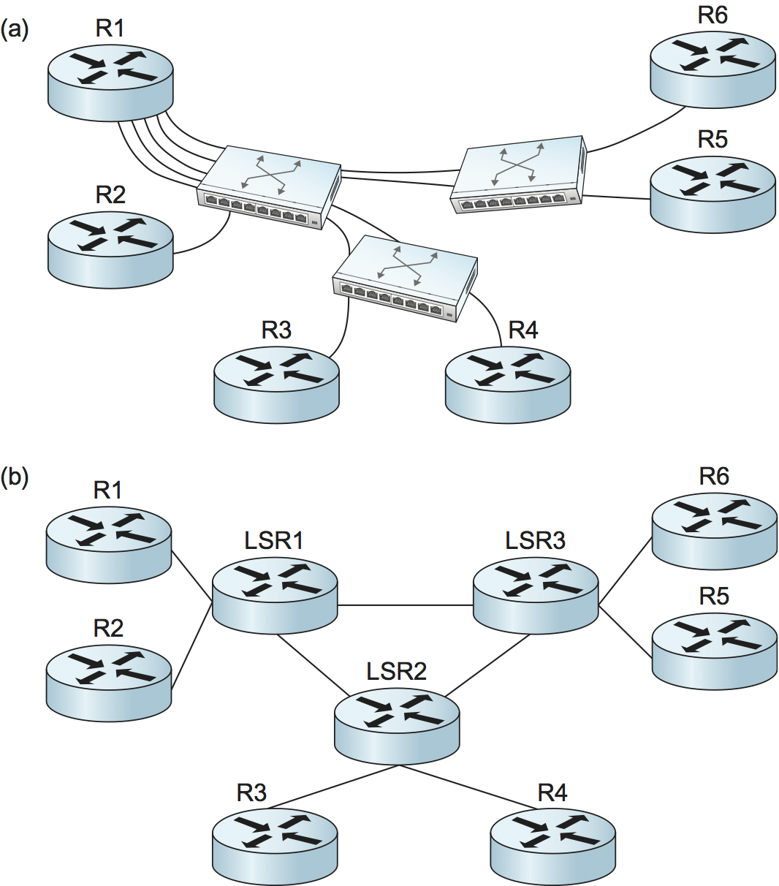
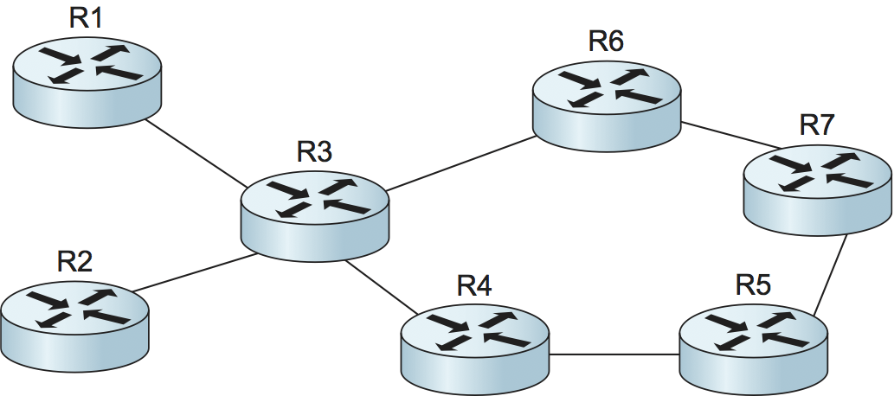
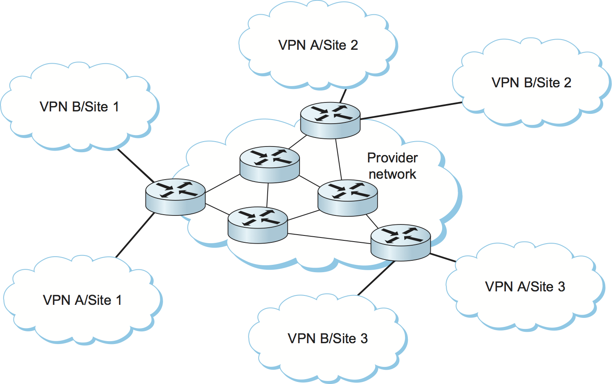

# {{Paj.Toe}}

我们继续讨论对IP的增强,方法是描述对Internet体系结构的添加,该体系结构使用非常广泛,但很大程度上对终端用户隐藏. 增强,称为*多协议标签交换* (MPLS) 将虚拟电路的一些特性与数据报的灵活性和鲁棒性相结合. 一方面,MPLS与基于数据报的Internet协议架构密切相关,它依靠IP地址和IP路由协议来完成工作. 另一方面,支持MPLS的路由器还通过检查相对短的ㄡ固定长度的标签来转发分组,并且这些标签具有本地范围,就像在虚拟电路网络中一样. 也许正是由于两种看似对立的技术的结合,MPLS在互联网工程界获得了某种程度上混合的接受. 

在看MPLS如何运作之前,合理地问"它有什么好处?"MPLS已经提出了很多要求,但目前有三种主要用途: 

-   在没有能力以正常方式转发IP数据报的设备上启用IP能力

-   为了沿着显式路由转发IP分组,预先计算的路由不一定与普通IP路由协议选择的路由匹配

-   支持某些类型的虚拟专用网络服务

值得注意的是,提高性能的最初目标之一不在名单上. 这与近年来在IP路由器的转发算法方面取得的进步以及决定性能的超出报头处理的复杂因素集有很大关系. 

了解MPLS如何工作的最好方法是查看它的使用示例. 在接下来的三节中,我们将举例说明上述MPLS的三个应用. 

## 目的地转发

Chandranmenon和Vargese发表了一篇论文,描述了一种叫做*螺纹索引*. 现在在MPLS启用的路由器中实现了一个非常类似的想法. 下面的例子说明了这个想法是如何工作的. 

<figure class="line">
	
	
	<figcaption>Routing tables in example network.</figcaption>
</figure>

考虑网络[图1](#mpls-dest). 最右边的两个路由器 (R3和R4) 都有一个连接的网络,带有前缀. `18.1.1/24`和`18.3.3/24`. 其余的路由器 (R1和R2) 具有路由表,该路由表指示每个路由器在将分组转发到这两个网络中之一时将使用哪个输出接口. 

当在路由器上启用MPLS时,路由器为其路由表中的每个前缀分配标签,并向其相邻路由器通告它表示的标签和前缀. 这个广告是在标签分发协议中进行的. 这说明了[图2](#label-dist). 路由器R2已经分配了标签值`15`对于前缀`18.1.1`标签值`16`对于前缀`18.3.3`. 这些标签可以在分配路由器的便利下被选择,并且可以被认为是路由表中的索引. 在分配标签之后,R2将标签绑定通告给它的邻居;在本例中,我们看到R2在标签之间通告绑定`15`和前缀`18.1.1`到R1. 这种广告的含义是R2已经说过,实际上,"请贴上标签". `15`发送给我的所有前缀的数据包`18.1.1`R1将标签存储在一个表中,该表与前缀一起,前缀表示为发送到该前缀的任何分组的远程或传出标签. 

在[图2 (c) ](#label-dist),我们看到另一个标签广告从路由器R3到R2的前缀`18.1.1`并且R2将它从R3中学习的远程标签放在表中的适当位置. 

<figure class="line">
	
	
	<figcaption>(a) R2 allocates labels and advertises bindings to
	R1. (b) R1 stores the received labels in a table. (c) R3
	advertises another binding, and R2 stores the received label in a
	table.</figcaption>
</figure>

在这一点上,我们可以看到当包在这个网络中转发时会发生什么. 假设一个数据包命中IP地址`18.1.1.5`从左边到达路由器R1. 在这种情况下,R1被称为A. *标签边缘路由器* (LER) ;LER在到达IP分组时执行完整的IP查找,然后向查询应用标签. 在这种情况下,R1会看到`18.1.1.5`匹配前缀`18.1.1`在它的转发表中,这个条目既包含输出接口又包含远程标签值. 因此,R1附加了远程标签. `15`发送之前的数据包. 

当数据包到达R2时,R2只查看数据包中的标签,而不是IP地址. R2中的转发表表示到达标签值的数据包. `15`应该发送接口1,并且它们应该携带标签值. `24`,如路由器R3的广告. 因此,R2重写或交换标签并将其转发到R3. 

所有这些应用和标签交换已经完成了什么?观察到,当R2在这个例子中转发包时,实际上不需要检查IP地址. 相反,R2只查看传入的标签. 因此,我们用标签查找代替了正常的IP目的地地址查找. 要理解为什么这很重要,请记住,尽管IP地址总是相同的长度,但是IP前缀的长度是可变的,并且IP目的地址查找算法需要找到*最长匹配*-与转发的数据包的IP地址中的高阶比特相匹配的最长前缀. 相比之下,刚才描述的标签转发机制是*精确匹配*算法. 例如,通过使用标签作为数组的索引,可以实现非常简单的精确匹配算法,其中数组中的每个元素是转发表中的一行. 

注意,虽然转发算法已经从最长匹配改变为精确匹配,但是路由算法可以是任何标准的IP路由算法 (例如,OSPF) . 在这个环境中,数据包将遵循的路径与如果不涉及MPLS时它将遵循的路径完全相同ℴℴIP路由算法选择的路径. 所有已经改变的是转发算法. 

这个例子说明了MPLS的一个重要的基本概念. 每个MPLS标签都与*转发等价类* (FEC) -在特定路由器中接收相同转发处理的一组数据包. 在这个例子中,路由表中的每个前缀是FEC;也就是说,匹配前缀18.1.1-无论IP地址的低阶位是什么-的所有分组沿着相同的路径被转发. 因此,每个路由器可以分配映射到18.1.1的一个标签,并且任何包含其高阶位匹配前缀的IP地址的分组都可以使用该标签进行转发. 

正如我们在随后的例子中看到的,FECS是一个非常强大和灵活的概念. FEC可以使用几乎任何标准形成;例如,与特定客户对应的所有分组可以被认为是在同一FEC中. 

回到手边的示例,我们观察到将转发算法从正常的IP转发改为标签交换有一个重要的结果: 以前不知道如何转发IP分组的设备可以用于在MPLS网络中转发IP流量. 这个结果最值得注意的早期应用是ATM交换机,它可以支持MPLS,而不需要改变其转发硬件. ATM交换机支持刚刚描述的标签交换转发算法,并且通过向这些交换机提供IP路由协议和分发标签绑定的方法,它们可以被转换成*标签交换路由器* (LSRs) -运行IP控制协议但使用标签交换转发算法的设备. 最近,同样的想法已经应用到光开关. 

在我们考虑将ATM交换机变成LSR的好处之前,我们应该把一些松散的部分联系起来. 我们说过标签贴在包上,但是它们到底贴在哪里呢?答案取决于承载数据包的链路类型. 两种常用的用于在数据包上传输标签的方法显示在[图3](#labels). 当IP分组作为完整的帧被携带时,如在大多数链路类型 (包括以太网和PPP) 上,标签作为垫片插入层2报头和IP (或其他层3) 报头之间,如图的下部所示. 然而,如果ATM交换机要充当MPLS LSR,则标签需要位于交换机可以使用它的位置,这意味着它需要位于ATM信元报头中,确切地说是人们通常发现虚拟电路标识符(VCI)和虚拟路径标识符(VPI)字段的位置. 

<figure class="line">
	
	
	<figcaption>(a) Label on an ATM-encapsulated packet; (b) label on
	a frame-encapsulated packet.</figcaption>
</figure>

<figure class="line">
	
	
	<figcaption>(a) Routers connect to each other using an overlay of
	virtual circuits. (b) Routers peer directly with LSRs.</figcaption>
</figure>

现在已经设计了一个ATM交换机可以用作LSR的方案,我们得到了什么?需要注意的一点是,我们现在可以构建一个网络,它使用传统IP路由器ㄡ标签边缘路由器和ATM交换机的混合物,这些交换机都用作LSR,并且它们都使用相同的路由协议. 为了理解使用相同协议的好处,请考虑另一种方案. 在[图4 (a) ](#overlay)我们看到在ATM网络上通过虚拟电路互连的一组路由器,称为*覆盖*网络. 在某个时候,这种类型的网络经常被构建,因为商业上可用的ATM交换机支持比路由器更高的总吞吐量. 今天,这样的网络不太常见,因为路由器已经赶上甚至超过ATM交换机. 然而,这些网络仍然存在,因为ATM交换机在网络骨干中的重要安装基础,这反过来部分归因于ATM支持诸如电路仿真和虚拟电路服务等一系列能力的能力. 

在覆盖网络中,每个路由器都可能通过虚拟电路连接到其他路由器中的每一个,但是在本例中,为了清楚起见,我们刚刚显示了从R1到所有对等路由器的电路. R1有五个路由邻居,并且需要与所有路由协议消息交换ℴℴ我们说R1有五个路由邻居. 相比之下,在[图4 (b) ](#overlay)ATM交换机已经用LSRs代替了. 不再有互连路由器的虚拟电路. 因此,R1只有一个邻接,具有LSR1. 在大型网络中,在交换机上运行MPLS导致每个路由器必须维护的邻接数目的显著减少,并且可以大大减少路由器必须做的工作量,以保持彼此了解拓扑变化. 

在边缘路由器和LSR上运行相同的路由协议的第二个好处是,边缘路由器现在对网络拓扑有了全面的了解. 这意味着,如果在网络内部某些链路或节点发生故障,则边缘路由器将比ATM交换机在不知道边缘路由器的情况下重新路由受影响的VC时有更好的机会选择一条好的新路径. 

注意,用LSR替换ATM交换机的步骤实际上是通过改变在交换机上运行的协议来实现的,但是通常不需要改变转发硬件;也就是说,ATM交换机通常可以通过仅升级其软件来转换为MPLSLSLSR. 此外,MPLS LSR可以在运行MPLS控制协议的同时继续支持标准ATM能力,这种模式被称为"夜间船舶"模式. 

最近,在无法本机转发IP分组的设备上运行IP控制协议的想法已经扩展到光开关和SONT多路复用器等STDM设备. 这就是众所周知的*广义MPLS* (GMPLS) . GMPLS的部分动机是为路由器提供光网络的拓扑知识,就像ATM的情况一样. 更为重要的是,没有用于控制光学器件的标准协议,所以MPLS看起来很适合这项工作. 

## 显式路由

IP有一个源路由选项,但是由于几个原因,它没有被广泛使用,包括只能指定有限数量的跳,并且因为它通常在大多数路由器的"快速路径"之外进行处理. 

MPLS为向IP网络添加与源路由类似的功能提供了一种方便的方法,尽管这种功能通常称为*显式路由*而不是*源路由*. 区别的一个原因是它通常不是选择路由的数据包的真正来源. 更经常地,它是服务提供商网络内部的路由器之一. [图5](#fish)显示了如何应用MPLS的显式路由能力的示例. 这种网络通常称为*鱼*网络因为它的形状 (路由器R1和R2形成尾部;R7在头上) . 

<figure class="line">
	
	
	<figcaption>A network requiring explicit routing.</figcaption>
</figure>

假设网络中的运算符[图5](#fish)已经确定从R1到R7的任何业务应该遵循路径R1-R3-R6-R7,并且从R2到R7的任何业务应该遵循路径R2-R3-R4-R5-R7. 这样的选择的一个原因是充分利用沿着R3到R7的两条不同路径的可用容量. 我们可以认为R1-to-R7通信量构成一个转发等价类,R2-to-R7通信量构成第二个FEC. 在正常的IP路由中,沿着不同的路径转发这两个类中的通信量是困难的,因为R3在作出转发决策时通常不查看通信量来自哪里. 

因为MPLS使用标签交换来转发分组,所以如果路由器启用了MPLS,则很容易实现期望的路由. 如果R1和R2在发送给R3之前给分组附加不同的标签,从而将它们识别为在不同的FEC中,那么R3可以沿着不同的路径从R1和R2转发分组. 随后出现的问题是网络中的所有路由器如何就使用什么标签以及如何转发具有特定标签的分组达成一致?显然,我们不能使用与前一节描述的相同的过程来分发标签,因为这些过程建立标签,使得数据包遵循IP路由选择的正常路径,这正是我们试图避免的. 相反,需要一种新的机制. 结果表明,用于此任务的协议是资源预留协议 (RSVP) . 现在,只要说可以沿着显式指定的路径 (例如,R1-R3-R6-R7) 发送RSVP消息并使用它在整个路径上建立标签转发表条目就足够了. 这与建立虚拟电路的过程非常相似. 

显式路由的一个应用是*交通工程*这是指确保网络中有足够的资源以满足其需求的任务. 准确控制交通流的路径是交通工程的重要组成部分. 显式路由也有助于使网络在面对失败时更有弹性,使用称为能力的能力. *快速重路由*. 例如,可以预先计算从路由器A到路由器B的显式避免某个链路L的路径. 在链路L失败的情况下,路由器A可以将目的地为B的所有业务沿着预先计算的路径发送. 备份路径的预计算和分组沿路径的显式路由的结合意味着A不需要等待路由协议分组通过网络或等待网络中的各种其他节点执行路由算法. 在某些情况下,这可以显著减少在故障点周围重新路由分组所花费的时间. 

关于显式路由,最后需要注意的一点是,显式路由不需要像上面的示例那样由网络运营商计算. 路由器可以使用各种算法来自动计算显式路由. 其中最常见的是*约束最短路径优先* (CSPF) ,这是一种链路状态算法,但它也需要各种*约束条件*考虑到. 例如,如果需要找到一条从R1到R7的路径,该路径可以承载100Mbps的提供负载,那么我们可以说,约束条件是每个链路必须具有至少100Mbps的可用容量. CSPF解决了这类问题. 

## 虚拟专用网与隧道

构建虚拟专用网络 (VPN) 的一种方法是使用隧道. 事实证明,MPLS可以被认为是建造隧道的一种方式,这使得它适合于建造各种类型的VPN. 

MPLS VPN最简单的形式是一个第2层VPN. 在这种类型的VPN中,MPLS用于跨支持MPLS的路由器的网络隧道第二层数据 (例如以太网帧或ATM信元) . 隧道的一个原因是提供某种网络服务 (如多播) ,而网络中的一些路由器不支持这种服务. 这里也适用同样的逻辑: IP路由器不是ATM交换机,因此您不能在传统路由器的网络上提供ATM虚拟电路服务. 然而,如果你有一对通过隧道互连的路由器,他们可以通过隧道发送ATM信元并仿真ATM电路. IETF中的这项技术的术语是*伪线仿真*.[图6](#atm-tunnel)说明了这个想法. 

<figure class="line">
	
	
	<figcaption>An ATM circuit is emulated by a tunnel.</figcaption>
</figure>

我们已经看到了如何构建IP隧道: 隧道入口处的路由器将要进行隧道传输的数据封装在IP报头中 (*隧道报头*) ,它代表路由器在隧道远端的地址,并像任何其他IP分组一样发送数据. 接收路由器在报头中接收具有其自身地址的分组,剥离隧道报头,并找到被隧道传输的数据,然后进行处理. 确切地说,它对数据的作用取决于它是什么. 例如,如果它是另一个IP分组,那么它将像正常IP分组一样转发. 然而,它不需要是IP分组,只要接收路由器知道如何处理非IP数据包. 我们将回到如何处理非IP数据的问题. 

MPLS隧道与IP隧道没有太大区别,只是隧道头由MPLS报头而不是IP报头组成. 回首我们的第一个例子[图2](#label-dist)我们看到路由器R1上贴了标签 (`15`) 向前缀18.1.1发送的每个数据包. 然后,这样的分组将遵循路径R1-R2-R3,路径中的每个路由器仅检查MPLS标签. 因此,我们观察到,没有要求R1仅沿着这条路径发送IP分组ℴℴ任何数据都可以包装在MPLS报头中,并且它将遵循相同的路径,因为中间的路由器从不超出MPLS报头. 在这方面,MPLS头就像IP隧道报头 (ExcPET只有4字节长的20字节的整数) . 沿着隧道 (MPLS或其他) 发送非IP流量的唯一问题是当非IP流量到达隧道末端时如何处理. 一般的解决方案是在隧道有效负载中携带某种解复用标识符,它告诉隧道末端的路由器做什么. 事实证明,MPLS标签完全适合于这样的标识符. 一个例子将说明这一点. 

假设我们希望通过一个支持MPLS路由器的网络将ATM信元从一个路由器传输到另一个路由器,如[图6](#atm-tunnel). 此外,我们假设目标是模拟ATM虚拟电路,即,信元以特定的VCI到达特定输入端口上的隧道入口或头部,并且应该离开特定输出端口上的隧道尾端以及可能不同的VCI. 这可以通过配置头和尾路由器来实现如下: 

-   头路由器需要配置有传入端口ㄡ传入VCIㄡ该仿真电路的解复用标签以及隧道端路由器的地址. 

-   尾部路由器需要配置输出端口ㄡ输出VCI和解复用标签. 

一旦路由器提供了这些信息,我们就可以看到ATM信元是如何被转发的. [图7](#pw-eg)说明了步骤. 

1.  ATM信元到达指定的输入端口上,具有适当的VCI值 (在这个例子中为101) . 

2.  磁头路由器附加识别仿真电路的解复用标签. 

3.  然后,头路由器附加第二个标签,这是隧道标签,将获得该数据包到尾部路由器. 这个标签是通过机制学习的,就像本节其他地方所描述的一样. 

4.  头和尾之间的路由器只使用隧道标签转发数据包. 

5.  尾路由器删除隧道标签,找到解复用标签,并识别仿真电路. 

6.  尾路由器将ATM VCI修改为正确的值 (在这种情况下为202) ,并将其发送到正确的端口. 

<figure class="line">
	
	
	<figcaption>Forward ATM cells along a tunnel.</figcaption>
</figure>

这个例子中的一个项目可能令人惊讶的是,包上有两个标签. 这是MPLS标签的有趣特性之一,可以堆叠在任何深度的包上. 这提供了一些有用的缩放能力. 在这个例子中,它允许单个隧道携带潜在的大量仿真电路. 

这里描述的相同技术可以应用于模拟许多其他第2层服务,包括帧中继和以太网. 值得注意的是,可以使用IP隧道提供几乎相同的功能;MPLS的主要优点是较短的隧道报头. 

<figure class="line">
	
	
	<figcaption>Example of a layer 3 VPN. Customers A and B each
	obtain a virtually private IP service from a single
	provider.</figcaption>
</figure>

在MPLS被用于隧道第2层服务之前,它也被用于支持层3 VPN. 我们不会详细讨论第三层VPN,它们相当复杂,但是我们会注意到,它们代表了当今MPLS最流行的用途之一. 第3层VPN还使用堆栈的MPLS标签来跨IP网络隧道分组. 然而,被隧道化的数据包本身就是IP分组,因此,*第3层*虚拟专用网. 在第3层VPN中,单个服务提供商操作支持MPLS的路由器网络,并向任意数量的不同客户提供"虚拟专用"IP网络服务. 也就是说,提供者的每个客户都有一些站点,并且服务提供者为每个客户创建了网络上没有其他客户的错觉. 客户看到一个IP网络互连自己的网站,没有其他网站. 这意味着每个客户在路由和寻址方面与所有其他客户隔离. 客户A不能直接发送数据包给客户B,*反之亦然*. 客户A甚至可以使用客户B所使用的IP地址. [图8](#mpls-vpn). 与第2层VPN一样,MPLS用于将分组从一个站点隧道传输到另一个站点;然而,隧道的配置是通过一些相当精细的BGP使用自动执行的,这超出了本书的范围. 

> 事实上,客户A通常是*可以*以一定的方式向客户B发送数据. 最有可能的是,客户A和客户B都与全球互联网有某种连接,因此客户A可能向客户B网络内部的邮件服务器发送电子邮件消息. VPN提供的"隐私"防止客户A不受限制地访问客户B网络内的所有机器和子网. 

综上所述,MPLS是一种相当通用的工具,已经应用于各种不同的网络问题. 它结合了通常与虚拟电路网络相关联的标签交换转发机制和IP数据报网络的路由和控制协议,以产生介于两个传统极端之间的一类网络. 这扩展了IP网络的能力,以便除其他外,能够更精确地控制路由和支持一系列VPN服务. 
