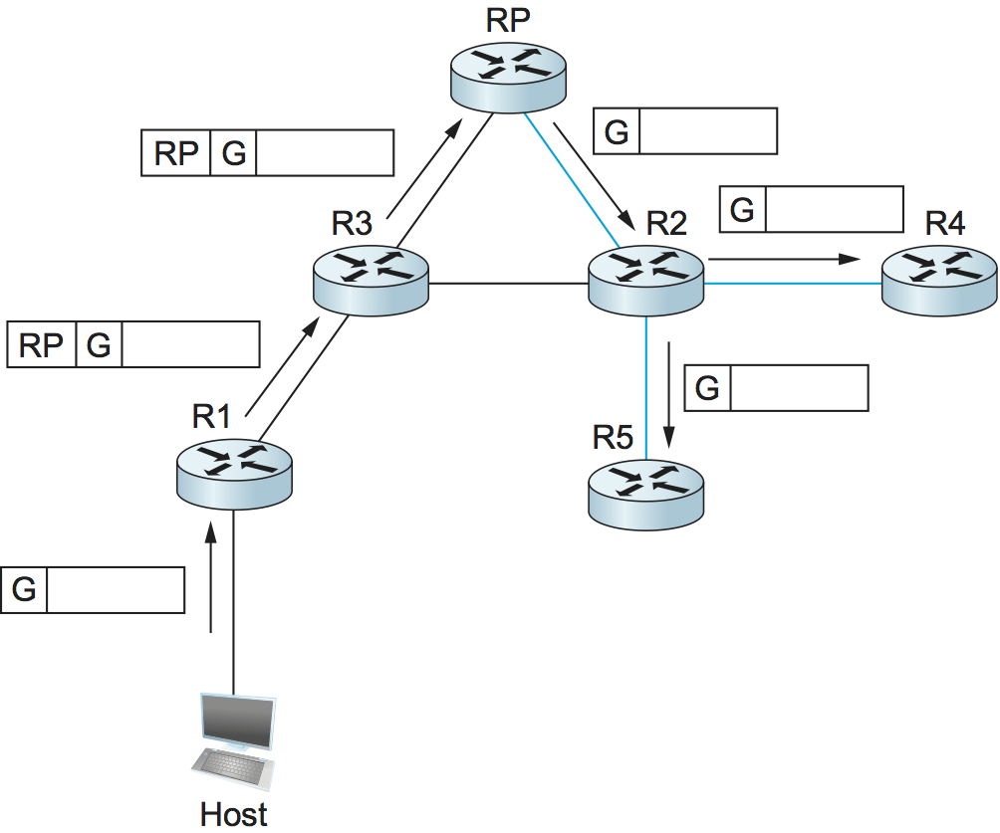

# {{Paj.Toe}}

正如我们在前面的章节中看到的,多址网络 (如以太网) 在硬件中实现多播. 然而,需要更广泛的多播能力的应用,这些能力在互联网络的规模上是有效的. 例如,当通过因特网广播电台时,必须将相同的数据发送到用户已调谐到该电台的所有主机. 在这个例子中,通信是一对多的. 一对多应用程序的其他示例包括向多个主机发送相同的新闻ㄡ当前股票价格或软件更新. 还有一些通信是多对多的应用程序,例如多媒体电话会议ㄡ在线多人游戏或分布式仿真. 在这种情况下,组的成员通常从多个发送者接收数据. 从任何特定的发送者,他们都接收相同的数据. 

通常的IP通信 (其中每个包必须被寻址并发送到单个主机) 不适合这种应用. 如果应用程序有数据要发送到组,则它必须向组的每个成员发送具有相同数据的独立分组. 这种冗余比需要消耗更多的带宽. 此外,冗余业务分布不均匀,而是集中在发送主机周围,并且容易超过发送主机和附近的网络和路由器的容量. 

为了更好地支持多对多和一对多通信,IP提供类似于由诸如以太网的多接入网络提供的链路级多播的IP级多播. 现在我们引入了用于IP的多播的概念,我们还需要一个术语来描述迄今为止已经描述的传统的IP一对一服务: 该服务称为*单播*.

基本IP组播模型是一种基于组播的多对多模型. *组*,每个组都有自己的IP*组播地址*. 作为组成员的主机接收发送到该组的多播地址的任何分组的副本. 主机可以处于多个组中,并且可以通过使用稍后将讨论的协议告诉其本地路由器来自由地加入和离开组. 因此,尽管我们认为单播地址与节点或接口相关联,但是多播地址与抽象组相关联,抽象组的成员资格随时间动态变化. 此外,原始IP组播服务模型允许*任何*主机向组发送多播通信量;它不必是组的成员,并且可能有任意数量的此类发送者到给定组. 

使用IP多播向组中的每个成员发送相同的分组,主机发送寻址到组多播地址的分组的单个副本. 发送主机不需要知道组中每个成员的单个单播IP地址,因为正如我们将看到的,这些知识分布在网络中的路由器中. 类似地,发送主机不需要发送分组的多个副本,因为每当路由器必须通过多个链路转发分组时,它们就会进行副本. 与使用单播IP向许多接收机传送相同分组相比,IP多播具有更高的可伸缩性,因为它消除了本来会在相同链路上多次发送的冗余通信量(分组),尤其是靠近发送主机的那些链路. 

IP的原始多对多组播已被补充,支持一对多组播的形式. 在这种一对多组播模型中,称为*源特定组播* (SSM) ,接收主机指定多播组和特定发送主机. 然后,接收主机将接收寻址到指定组的多播,但前提是它们来自指定的发送方. 许多因特网多播应用 (例如,无线电广播) 适合SSM模型. 与SSM相比,IP的原来的多对多模型有时被称为*任意源组播* (ASM) . 

主机通过与其本地路由器通信,使用专用协议发出加入或离开多播组的信号. 在IPv4中,该协议是*因特网组管理协议*在IPv6中,它是*听发现* (MLD) . 然后,路由器有责任使组播行为正确的主机. 因为主机在应该离开多播组时可能失败 (例如,在崩溃或其他故障之后) ,路由器周期性地轮询LAN,以确定哪些组仍然对附加的主机感兴趣. 

## 多播地址

IP具有为多播地址保留的地址空间的子空间. 在IPv4中,这些地址被分配在D类地址空间中,并且IPv6的一部分地址空间也保留给多播组地址. 组播范围的一些子区域被保留用于域内组播,因此它们可以被不同的域独立地重用. 

因此,当我们忽略所有多播地址共享的前缀时,IPv4中可能存在28位的多播地址. 当试图在局域网 (LAN) 上利用硬件多播时,这就带来了一个问题. 让我们以以太网为例. 当我们忽略它们的共享前缀时,以太网多播地址只有23个比特. 换句话说,为了利用以太网组播,IP必须将28位IP组播地址映射到23位以太网组播地址. 这是通过采用任何IP组播地址的低阶23位作为其以太网组播地址并且忽略高阶5位来实现的. 因此,32× (2美元$^ 5美元) 的IP地址映射到每个以太网地址中. 

当以太网上的主机加入IP组播组时,它将其以太网接口配置为接收具有相应以太网组播地址的任何分组. 不幸的是,这导致接收主机不仅接收它希望的多播流量,而且接收发送到映射到相同以太网地址的其它31个IP多播组中的任何一个的流量,如果它们被路由到该以太网的话. 因此,接收主机上的IP必须检查任何多播分组的IP报头,以确定该分组是否真正属于期望的组. 总之,多播地址大小的不匹配意味着多播通信量可能给对通信量所发送的组甚至不感兴趣的主机带来负担. 幸运的是,在一些交换网络 (例如交换式以太网) 中,这个问题可以通过其中交换机识别不想要的分组并丢弃它们的方案来缓解. 

一个令人困惑的问题是发送者和接收者如何学习首先使用的多播地址. 这通常通过带外方式处理,并且有一些非常复杂的工具来支持在因特网上发布组地址. 

## 组播路由 (DVMRP,皮姆河,MSDP) 

路由器的单播转发表表明,对于任何IP地址,使用哪一个链路来转发单播分组. 为了支持多播,路由器必须另外具有多播转发表,该表基于多播地址指示使用哪些链路 (可能多于一个) 来转发多播分组 (如果要在多个链路上转发分组,则路由器复制该分组) . 因此,在单播转发表共同指定一组路径的情况下,多播转发表共同指定一组树: *组播分发树*. 此外,为了支持特定于源的多播 (并且事实证明,对于某些类型的任何源多播) ,多播转发表必须基于多播地址和源的 (单播) IP地址的组合来指示要使用哪些链接,再次指定一组树. 

组播路由是确定组播分发树的过程,更具体地说,是构建组播转发表的过程. 与单播路由一样,多播路由协议"工作"是不够的,它还必须随着网络的发展而合理地扩展,并且必须适应不同路由域的自治. 

### DVMRP

单播中的距离矢量路由可以扩展到支持组播. 由此产生的协议称为*间量组播路由选择协议*或DVMRP. DVMRP是第一个看到广泛使用的多播路由协议. 

回想一下,在距离向量算法中,每个路由器维护一个表. `Destination, Cost, NextHop`元组,并交换一个列表`(Destination, Cost)`对与其直接连接的邻居. 扩展该算法以支持组播是一个两阶段的过程. 首先,我们创建一个广播机制,允许数据包转发到互联网上的所有网络. 其次,我们需要改进这种机制,以便它裁剪不具有属于多播组的主机的网络. 因此,DVMRP是几种描述的多播路由协议之一. *洪水和修剪*协议. 

给定单播路由表,每个路由器知道给定的当前最短路径. `destination`经历`NextHop`. 因此,每当路由器从源S接收到多播分组时,如果并且仅当分组通过到S的最短路径(即,分组到来)的链路到达时,路由器在所有输出链路(分组到达的链路除外)上转发分组. *从*这个`NextHop`与路由表中的S相关联. 这种策略有效地将数据包从S溢出,但不将数据包循环回S. 

这种方法有两个主要缺点. 首先是它确实淹没了网络;它没有提供避免在多播组中没有成员的LAN的规定. 我们在下面解决这个问题. 第二个限制是,给定的分组将通过连接到该LAN的每个路由器在LAN上转发. 这是由于在除了分组到达的链路之外的所有链路上泛洪分组的转发策略,而不考虑那些链路是否是根源于源的最短路径树的一部分. 

第二个限制的解决方案是消除当不止一个路由器连接到给定LAN时产生的重复广播分组. 这样做的一种方法是指定一个路由器作为*起源*相对于源,每个链路的路由器,其中仅允许父路由器通过LAN从该源转发多播分组. 选择到源S具有最短路径的路由器作为父路由器;根据哪个路由器具有最小地址,将破坏两个路由器之间的连接. 给定路由器可以基于其与邻居交换的距离向量消息来学习它是LAN的父节点 (再次相对于每个可能的源) . 

注意,这种细化要求每个路由器为每个源保留一个比特,用于指示它是否是源/链路对的父级. 请记住,在因特网设置中,源是网络,而不是主机,因为因特网路由器只对在网络之间转发分组感兴趣. 由此产生的机制有时被称为*反向路径广播* (RPB) 或*逆向路径转发* (RPF) . 路径是反向的,因为我们在考虑最短路径. *来源*在进行转发决策时,与单播路由相比,它寻找给定路径的最短路径. *目的地*.

刚刚描述的RPB机制实现了最短路径广播. 现在我们要修剪一组网络,该组网络接收寻址到组G的每个数据包,以排除那些没有属于组G的主机的网络. 这可以分两个阶段完成. 首先,我们需要认识到什么时候*叶*网络没有群组成员. 确定网络是叶子很容易ℴℴ如果如上所述的父路由器是网络上唯一的路由器,那么网络就是叶. 确定是否有任何组成员驻留在网络上是通过让组成员G的每个主机通过网络定期地宣布这一事实来完成的,如我们先前对链路状态多播的描述中所述. 然后,路由器使用此信息来决定是否转发通过该LAN向G发送的多播分组. 

第二阶段是把这个"没有G成员"的信息传播到最短路径树上. 这是通过增加路由器来实现的. `(Destination, Cost)`对,它用叶子组感兴趣的组发送给它的邻居,以接收多播数据包. 然后,可以将此信息从路由器传播到路由器,以便对于其每个链路,给定路由器知道应该转发多播分组的组. 

注意,在路由更新中包含所有这些信息是相当昂贵的事情. 因此,在实践中,只有当一些源开始向该组发送分组时,才交换该信息. 换言之,策略是使用RPB,它向基本距离向量算法添加少量开销,直到特定的多播地址变为活动. 此时,对接收寻址到该组的分组不感兴趣的路由器大声疾呼,并且该信息被传播到其他路由器. 

### PIM-SM

*与协议无关的多播*或PIM,是针对早期多播路由协议的缩放问题而开发的. 特别地,人们认识到,现有协议在具有相对小比例的路由器希望接收特定组的流量的环境中伸缩性不好. 例如,如果大多数路由器首先不想接收通信量,那么向所有路由器广播通信量直到它们明确要求从分发中移除通信量不是一个好的设计选择. 这种情况非常普遍,PIM将问题空间划分为*稀疏模式*和*密集模式,*其中稀疏和密集指的是要多播的路由器的比例. PIM密集模式 (PIM-DM) 使用洪水和修剪算法,如DVMRP,并遭受相同的可扩展性问题. PIM稀疏模式 (PIM-SM) 已成为占主导地位的组播路由协议,是我们这里讨论的重点. 顺便说一下,PIM的"协议独立"方面指的是这样一个事实,即与早期协议 (如DVMRP) 不同,PIM不依赖于任何特定种类的单播路由ℴℴ它可以与任何单播路由协议一起使用,如下面我们将看到的. 

在PIM-SM中,路由器使用PIM协议消息显式地加入多播分发树,称为`Join`信息. 请注意,与DVMRP的方法相比,首先创建广播树,然后修剪不感兴趣的路由器. 出现的问题是把这些送到哪里`Join`消息,毕竟,任何主机 (和任意数量的主机) 都可以发送给多播组. 为了解决这个问题,PIM-SM给每个组分配一个称为*交会点* (RP) . 通常,域中的许多路由器被配置为候选RP,并且PIM-SM定义了一组过程,通过该过程域中的所有路由器可以同意将路由器用作给定组的RP. 这些过程相当复杂,因为它们必须处理各种各样的场景,例如候选RP失败以及由于许多链路或节点故障而将一个域划分成两个单独的网络. 在本次讨论的其余部分中,我们假设域中的所有路由器都知道给定组的RP的单播IP地址. 

多播转发树是路由器发送的结果. `Join`消息到P.SIM-SM允许构建两种类型的树: *共享*树,可以由所有发件人使用,和*源特定*树,它只能由特定的发送主机使用. 正常操作模式首先创建共享树,如果有足够的通信量保证共享树,则创建一个或多个特定于源的树. 因为构建树在路由器中沿着树安装状态,所以缺省设置为一个组只有一个树,而不是一个组的每个发送者都有一个树. 

<figure class="line">
	
	
	<figcaption>PIM operation: (a) R4 sends `Join` to RP and joins
	shared tree; (b) R5 joins shared tree; (c) RP builds
	source-specific tree to R1 by sending `Join` to R1; (d) R4 and R5
	build source-specific tree to R1 by sending `Join`s to
	R1.</figcaption>
</figure>

当路由器发送一个`Join`对G组的RP消息,使用普通IP单播传输来发送. 这说明了[图1 (a) ](#pim-shared),路由器R4正在发送一个`Join`到某个集合的交会点. 最初的`Join`消息是"通配符";也就是说,它适用于所有发件人. 一`Join`消息显然必须在到达RP之前通过一些路由器序列 (例如,R2) . 沿着路径的每个路由器看着`Join`并为共享树创建一个转发表条目,称为\* (g) 条目 (在哪里) \*意思是"所有发件人". 若要创建转发表条目,请查看其上的接口`Join`到达并标记该接口作为它应该转发该组的数据分组的接口. 然后确定它将用来转发哪个接口. `Join`对于RP,这将是发送到该组的传入分组唯一可接受的接口. 然后它转发`Join`最后,消息到达RP,完成树分支的构造. 这样构造的共享树被显示为从RP到R4的实线. [图1 (a) ](#pim-shared).

随着更多路由器的发送`Join`对于Rp,它们会导致新的分支添加到树中,如图中所示[图1 (b) ](#pim-shared). 请注意,在这种情况下,`Join`只需要移动到R2,R2可以简单地通过向为此组创建的转发表条目添加新的传出接口将新分支添加到树. R2不需要转发`Join`在Rp注释中,这个过程的最终结果是建立一个根为RP的树. 

此时,假设主机希望向组发送消息. 为此,它构造一个以适当的多播组地址作为目的地的分组,并将其发送到其本地网络上的路由器,该路由器称为*指定路由器* (DR) . 假设DR是R1的[图1](#pim-shared). 此时,R1和RP之间没有这个多播组的状态,因此不是简单地转发多播分组,而是R1*隧道*也就是说,R1将组播包封装在PIM内. `Register`它发送给RP的单播IP地址的消息. `Register`消息,并在IP分组内查找到该组的多播地址. 当然,RP确实知道如何处理这样的数据包,它将它发送到共享树,其中RP是根. 在例子中[图1](#pim-shared)这意味着RP将数据包发送到R2,R2可以将其转发到R4和R5. 从R1到R4和R5的数据包的完整传输显示在[图2](#pim-deliver). 我们看到隧道数据包从一个R1传输到RP,带有一个额外的IP报头,其中包含RP的单播地址,然后寻址到G的多播数据包沿着共享树前进到R4和R5. 

在这一点上,我们可能会试图宣告成功,因为所有主机都可以这样发送给所有接收方. 然而,在去往RP的路径上,分组的封装和解封装存在一些带宽效率和处理成本,因此RP将关于这个组的知识强制到介入的路由器中,从而可以避免隧道. 它发送一个`Join`向发送主机的消息[图1 (c) ](#pim-shared)) 这样`Join`向主机移动,它使路由器沿着路径 (R3) 了解组,以便DR可以将分组发送到组. *本地的* (即,不隧道) 多播数据包. 

<figure class="line">
	
	
	<figcaption>Delivery of a packet along a shared tree. R1 tunnels
	the packet to the RP, which forwards it along the shared tree to
	R4 and R5.</figcaption>
</figure>

在这个阶段要注意的一个重要细节是`Join`由RP发送到发送主机的消息是特定于发送方的,而之前由R4和R5发送的消息应用于所有发送方. 因此,新的效果`Join`就是创造*特定发送者*在被识别的源和RP之间的路由器中的状态,这被称为 (s,g) 状态,因为它适用于一个组的一个发送器,并且与\* (g) 状态,它安装在接收器和RP上,适用于所有发送者. 因此,在[图1 (c) ](#pim-shared)我们看到从R1到RP的源特定路由 (由虚线表示) 和从RP到接收器的所有发送者都有效的树 (由实线表示) . 

下一个可能的优化是用源特定树替换整个共享树. 这是可取的,因为通过RP从发送者到接收者的路径可能比最短的可能路径长得多. 这很可能是由一些发送者观察到的高数据率触发的. 在这种情况下,树的下游端的路由器说,R4在我们的示例中发送特定的源. `Join`朝向源头. 由于它遵循通向源的最短路径,所以一路上的路由器为这个树创建 (S,G) 状态,结果是树在源处有根,而不是RP. [图1 (d) ](#pim-shared). 请注意,这棵树不再涉及RP了. 为了简化图表,我们已经从图中删除了共享树,但实际上,所有具有组接收器的路由器都必须留在共享树上,以防出现新的发送器. 

现在我们可以看到为什么PIM是协议无关的. 其所有用于构建和维护树的机制都利用单播路由,而不依赖于任何特定的单播路由协议. 树木的形成完全取决于`Join`消息遵循,这是由单播路由所选择的最短路径决定的. 因此,确切地说,PIM是"单播路由协议无关的",与DVMRP相比. 请注意,PIM与Internet协议绑定得非常紧密ℴℴ就网络层协议而言,它不是协议独立的. 

PIM-SM的设计再次说明了构建可伸缩网络的挑战,以及可伸缩性如何有时与某种最优性相冲突. 共享树当然比特定于源的树更具伸缩性,因为它将路由器中的总状态减少到组数量的顺序,而不是发送者数量乘以组数量的顺序. 然而,源特定树可能是必要的,以实现有效的路由和链路带宽的有效使用. 

### 域间组播 (MSDP) 

在域间组播中,PIM-SM有一些明显的缺点. 特别地,一个组的单个RP的存在违背了域是自治的原理. 对于给定的组播组,所有参与域将依赖于RP所在的域. 此外,如果存在发送方和一些接收方共享单个域的特定多播组,则多播通信量仍然必须首先通过具有该多播组的RP的任何域从发送方路由到那些接收方. 因此,PIM-SM协议通常不跨域使用,仅在域内使用. 

为了利用PIM-SM跨域扩展多播,设计了组播源发现协议 (MSDP) . MSDP用于通过连接不同域的RP来连接不同的域,每个域在内部运行PIM-SM,并具有自己的RP. 每个RP在其他域中有一个或多个MSDP对等RPS. 每一对MSDP对等体通过一个TCP连接来连接,在该TCP连接上运行MSDP协议. 总之,给定组播组的所有MSDP对等体形成用作广播网络的松散网格. 使用我们在DVMRP上下文中讨论的反向路径广播算法,通过对等RP的网格来广播MSDP消息. 

MSDP通过RPS网格广播什么信息?不是组成员信息;当主机加入一个组时,信息将流到最远的地方是它自己的域的RP. 相反,它是源-组播发送方信息. 每个RP都知道它自己域中的源,因为它接收到一个`Register`消息每当出现新的来源. 每个RP周期性地使用MSDP广播. `Source
Active`消息给它的对等体,提供源的IP地址ㄡ组播组地址和发起RP的IP地址. 

<figure class="line">
	
	
	<figcaption>MSDP operation: (a) The source SR sends a `Register`
	to its domain's RP, RP1; then RP1 sends a source-specific `Join`
	to SR and an MSDP `Source Active` to its MSDP peer in Domain B,
	RP2; then RP2 sends a source-specific `Join` to SR. (b) As a
	result, RP1 and RP2 are in the source-specific tree for source
	SR.</figcaption>
</figure>

如果接收到其中一个广播的MSDP对等RP具有多播组的活动接收器,则发送特定的源. `Join`,在RP的自身代表,到源主机,如[图3 (a) ](#msdp). 这个`Join`消息将源特定树的分支构建到该RP,如图所示[图3 (b) ](#msdp). 结果是,作为MSDP网络的一部分并且具有针对特定多播组的活动接收器的每个RP都被添加到新源的源特定树中. 当RP从源接收多播时,RP使用其共享树将多播转发到其域中的接收器. 

### 源特定组播 (PIM-SMSM) 

PIM的原始服务模型和早期的组播协议一样,是一个多对多的模型. 接收器加入一个组,任何主机都可以发送给组. 然而,在20世纪90年代末人们认识到,增加一对多模型可能是有用的. 毕竟,许多组播应用程序只有一个合法的发送者,比如在通过互联网发送的会议上的发言者. 我们已经看到,在最初使用共享树之后,PIM-SM可以创建特定于源的最短路径树作为优化. 在原来的PIM设计中,这种优化是不可见的主机只有路由器加入源特定树. 然而,一旦认识到需要一对多服务模型,就决定使PIM-SM的源特定路由能力显式地可用于主机. 事实证明,这主要需要改变IGMP及其IPv6模拟,MLD,而不是PIM本身. 新曝光的能力现在被称为PIM SSM (PIM源特定组播) . 

PIM-SMSM引入了一个新的概念,*通道*组地址G看起来像普通的IP组播地址,IPv4和IPv6都为SSM分配了组播地址空间的子区域. 为了使用PIM-SMSM,主机将IGMP成员报告消息中的组和源都指定为本地路由器. 该路由器然后发送特定的PIM-SM源. `Join`向源的消息,从而在特定于源的树中向自身添加分支,正如上面针对"普通"PIM-SM所描述的,但是绕过整个共享树阶段. 由于结果树是特定于源的,只有指定的源可以在该树上发送数据包. 

PIM-SSM的引入提供了一些显著的好处,特别是因为对一对多组播的需求相对较高: 

-   多播更直接地传递给接收者. 

-   信道的地址实际上是多播组地址加上源地址. 因此,给定一定范围的组播组地址将专门用于SSM,多个域可以独立地且无冲突地使用相同的组播组地址,只要它们仅与它们自己的域中的源一起使用. 

-   因为只有指定的源才能发送给SSM组,所以基于恶意主机的攻击风险较小,这些恶意主机以虚假的多播流量压倒了路由器或接收器. 

-   PIM-SMSM可以跨域使用,就像在域中使用一样,而不依赖于任何类似MSDP的东西. 

SSM,因此,是一个非常有用的添加到组播服务模型. 

### 双向树 (BIDE-PIM) 

我们结束了对多播的讨论,并对PIM进行了另一种增强. *双向PIM*. BIDIR-PIM是PIM-SM的最新变体,它非常适合域内的多对多多多组播,特别是当发送方和接收方与例如多方视频会议中的组相同. 与PIM-SM中一样,未来的接收器通过发送IGMP成员关系报告消息 (必须不是特定于源的) 来加入组,并且基于RP的共享树用于将多播分组转发给接收器. 然而,与PIM-SM不同,共享树也有分支. *来源*. 对于PIM-SM的单向树来说,这没有任何意义,但是BIDIR-PIM的树是双向的ℴℴ从下游分支接收多播分组的路由器可以在树上转发多播分组,也可以在其他分支上转发多播分组. 将分组传送到任何特定接收器的路径只在沿着该分支到达该接收器之前根据需要到达树的最上端. 查看从R1到R2的多播路由[图4 (b) ](#pim-bidir)举个例子. R4在向R2转发多播分组的同时,将其转发到R5的同一分组的副本. 

BIDIR-PIM的一个令人惊讶的方面是,实际上不需要RP. 所有需要的是可路由的地址,它被称为RP地址,即使它根本不需要是RP的地址或任何东西. 这怎么可能呢?一`Join`从接收器向RP地址转发,直到它到达路由器,路由器具有RP地址将驻留的链路上的接口,Join终止. 这个[图4 (a) ](#pim-bidir)展示了一个`Join`从R2终止于R5,以及`Join`从R3终止于R6. 组播分组的上行转发类似地流向RP地址,直到它到达具有RP地址所在链路上的接口的路由器,但随后路由器将组播分组转发到该链路上,作为上行转发的最后步骤,确保所有该链路上的其他路由器接收分组. 这个[图4 (b) ](#pim-bidir)说明源自R1的组播业务流. 

<figure class="line">
	
	
	<figcaption>BIDIR-PIM operation: (a) R2 and R3 send `Join`s toward
	the RP address that terminate when they reach a router on the RP
	address's link. (b) A multicast packet from R1 is forwarded
	upstream to the RP address's link and downstream wherever it
	intersects a group member branch.</figcaption>
</figure>

因此,BiDI-PIM不能跨域使用. 另一方面,它比PIM-SM在域内的多对多组播具有几个优点: 

-   由于路由器已经知道如何将多播分组路由到RP地址,所以没有源注册过程. 

-   这些路由比使用PIM-SM共享树的路由更直接,因为它们只在必要时到达树顶,而不是一直到RP. 

-   双向树比PIM-SM的源特定树使用更少的状态,因为从来没有源特定状态.  (另一方面,路由将比源特定树更长) . 

-   RP不能是瓶颈,并且实际上不需要实际RP. 

从PIM内部有许多不同的组播方法这一事实可以得出的结论是,组播是一个很难找到最优解的问题空间. 您需要决定要优化哪些标准 (带宽使用ㄡ路由器状态ㄡ路径长度等) 以及要支持哪种类型的应用程序 (一对多ㄡ多对多等) ,然后才能为任务选择"最佳"多播模式. 
